# Exercise 01: Creating a Fabric Workspace and Eventhouse for Real-Time Intelligence
### Estimated duration: 30 minutes

In this exercise, you will explore **Real-Time Intelligence** to gain insights from streaming data, and create a **Fabric Workspace** to organize and collaborate on your projects. You will set up an **Eventhouse** to efficiently store and analyze event-driven data, enable **OneLake Availability** for seamless data integration.

## Lab objectives: 
In this lab, you will be able to complete the following tasks:

- Task 1: Experience Real-Time Intelligence.  
- Task 2: Create a Fabric Workspace.
- Task 3: Create an Eventhouse.
- Task 4. Enable OneLake Availability.

### Task 1: Experience Real-Time Intelligence  
In this task, you will explore Real-Time Intelligence and its categories, gaining an understanding of its various components and functionalities.

1. Select **Workloads** icon on the left of your screen. A dialog with the list of Fabric experiences will open. The list of experiences includes Power BI, Data Factory, Industry Solutions, Real-Time Intelligence, Data Engineering, Data Science and Data Warehouse. Let’s explore.

    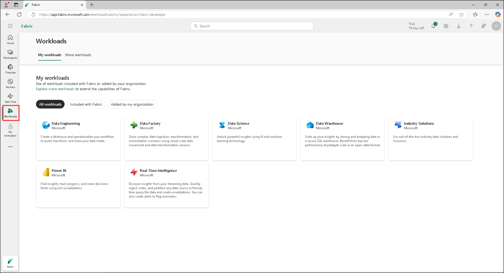

1. Click on the **Real-Time Intelligence** experience under **Workloads**.

    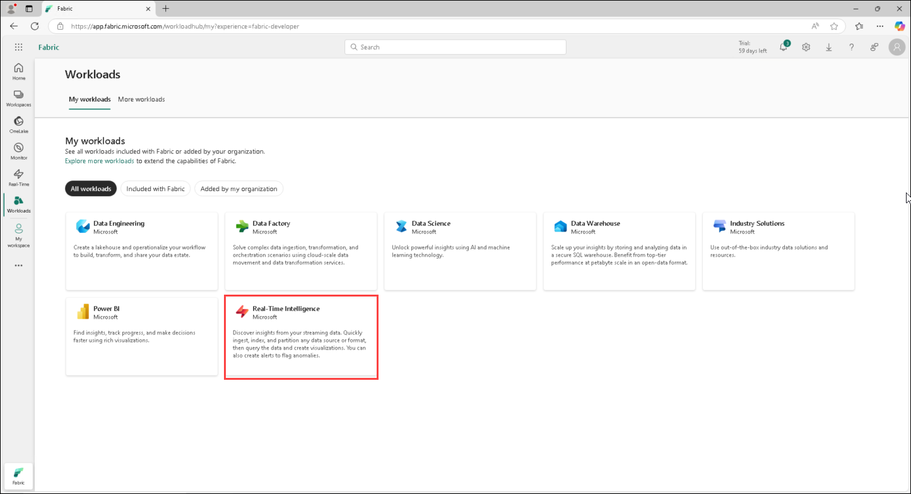

1. You will be navigated to **Real-Time Intelligence Home page**. You will see **Item types** under **About**, and **Get started** categories. With the **Item type** category notice the items:

    a. **Eventhouse:** Used to create a workspace of one or multiple KQL database(s), which can be shared across projects. Also creates a KQL Database within the Eventhouse.
    
    b. **KQL** **Queryset:** Used to run queries on the data to produce shareable tables and visuals.
    
    c. **Real-Time Dashboard**: A collection of tiles, optionally organized in pages, where each tile has an underlying query and a visual representation.
    
    d. **Eventstream:** Used to capture, transform, and route real-time event stream.
    
    e. **Activator:** For automatically taking actions when patterns or conditions are detected in changing data.

    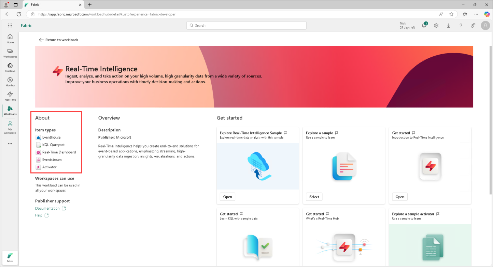

### Task 2: Create a Fabric Workspace

In this task, you will create a workspace to begin working with Real-Time Intelligence.

1. Now let’s create a workspace with Fabric license. Select **Workspaces (1)** from the navigation bar on the left.

1. Select  **+ New workspace (2)**.

    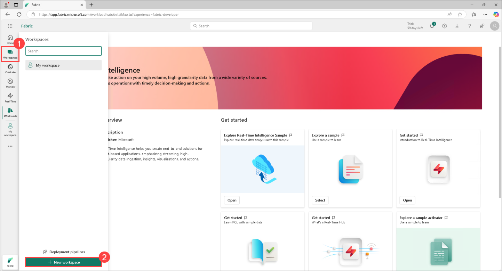

1. The **Create a workspace** dialog opens on the right side of the browser.

1. In the **Name** field enter **RTI_<inject key="DeploymentID" enableCopy="false"></inject>** (1). 

   >**Note**: The user ID will be unique for each user, and the workspace name must also be unique. Ensure that a green check mark with **"This name is available"** appears below the Name field.

1. If you would like, you can enter a **Description** for the workspace. This is an optional field.

1. Click on **Advanced (2)** to expand the section.

    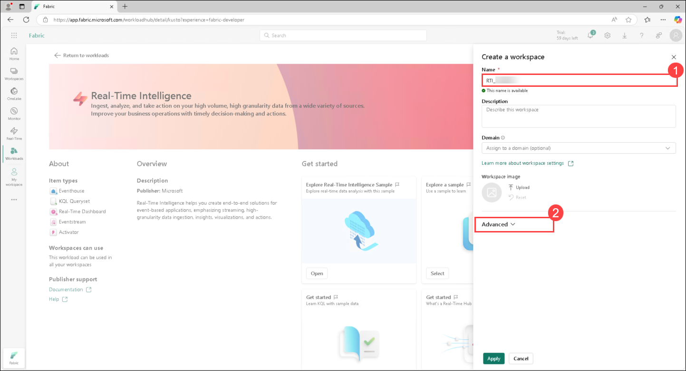

1. Under **License mode**, ensure that **Trial (1)** is selected (it should be the default option), then click **Apply (2)** to create a new workspace.

    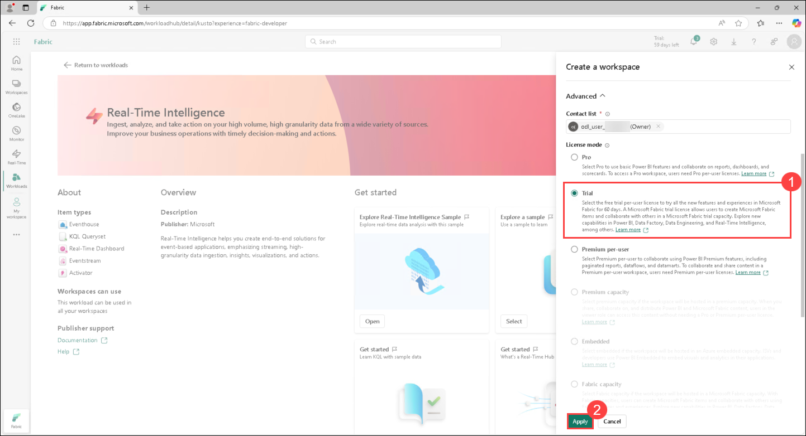

    >**Note:** If the **Introducing task flows** dialog opens, click on **Got it**.
    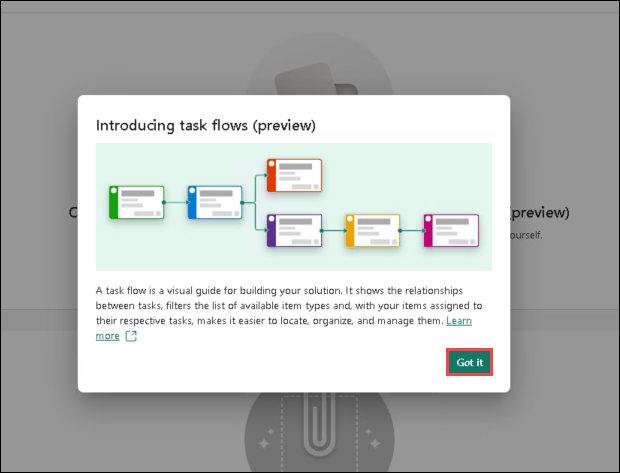

### Task 3: Create an Eventhouse
In this task, you will create an Eventhouse, which is used for storing, processing, and analyzing real-time streaming data efficiently within Microsoft Fabric.

1. Click the **+ New item** box to open a new pane that has all the items you can create in this Fabric workspace.

    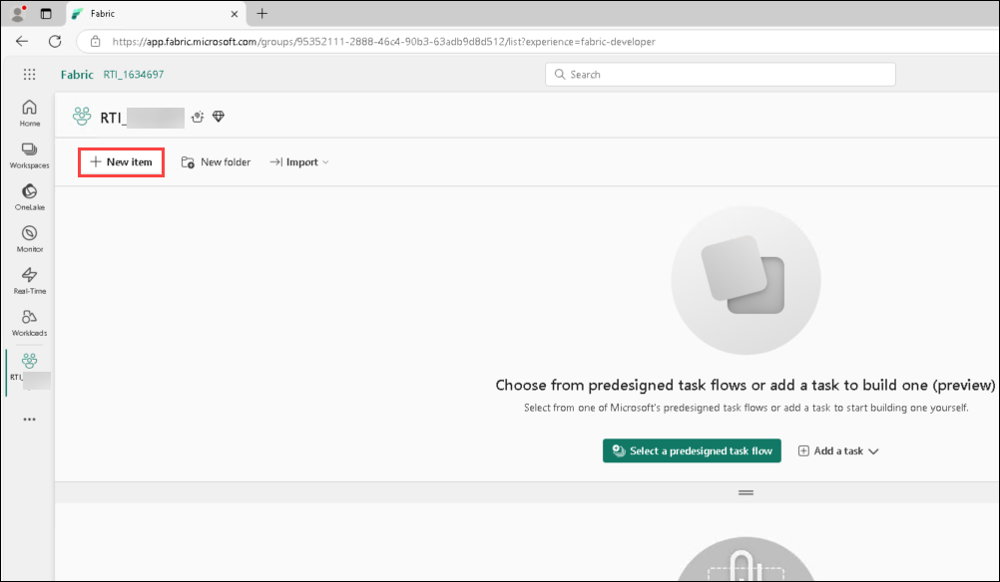

1. Search for **Eventhouse(1)** and Select the **Eventhouse(2)** option from *Store data* . As we have talked about this can be viewed  similarly to a Lakehouse in that we can store data but this Eventhouse is focused around real time data.

    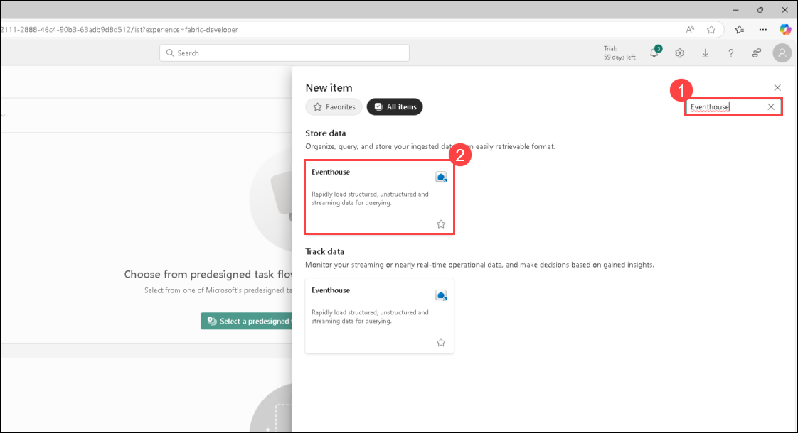

1. In the window that appears, give your Eventhouse the name, **WebEvents_EH (1)** and click on **Create (2)**.

    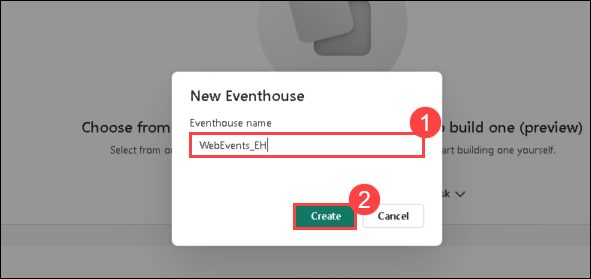

1. The Eventhouse efficiently handles real-time data streams, enabling organizations to ingest, process, and analyze data in near real-time. It is optimized for time-based, streaming events, automatically indexing and partitioning data based on ingestion time.

### Task 4. Enable OneLake Availability
In this task, you’ll enable OneLake Availability to automatically copy KQL Database data to OneLake in Delta format, allowing seamless querying through Lakehouse and other tools. It’s best enabled before loading large datasets and can be set per table.

1. When an Eventhouse is created, a KQL Database with the same name is created as well. To open the KQL Database click on the Database **WebEvents_EH** in the section **KQL Databases**.

    

2. After selecting the KQL Database click on the switch **availibility** to enabled the OneLake availibility as shown in the screenshot.

    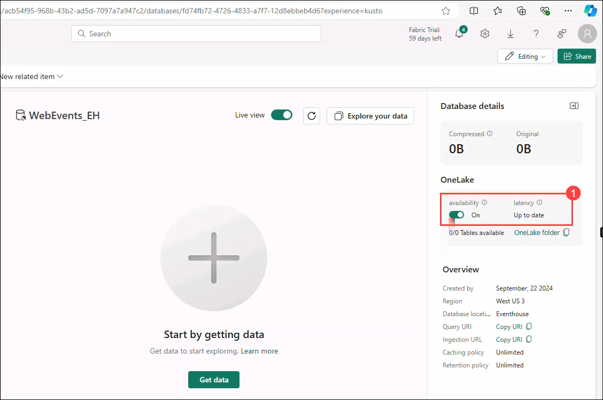

    >**Note:** Newly created tables will automatically inherit the "OneLake availability" setting from the Database level

3. Now the dialog enable OneLake availibility is shown. Ensure that Apply to existing tables is checked and click on the button **enable**.

    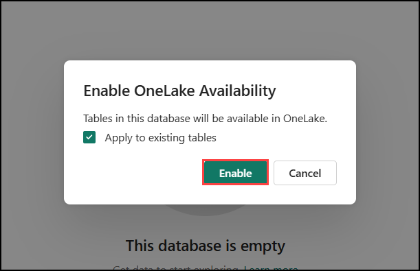

## Review
In this lab you have completed the following:
- Experienced Real-Time Intelligence.  
- Created a Fabric Workspace.
- Created an Eventhouse.
- Enabled OneLake Availability.

### You have successfully completed the Exercise
