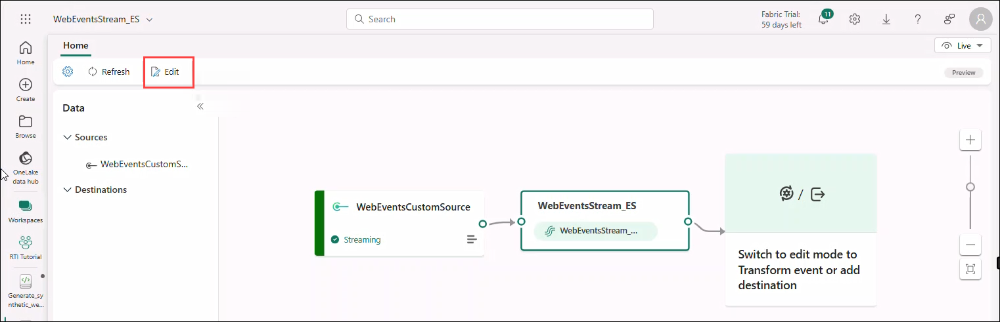
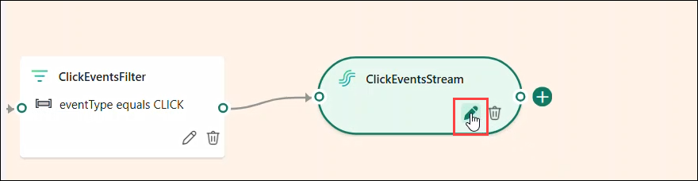

# Build A Fabric Real-Time Intelligence Solution in a Day 
## Estimated duration: 4 hours
In this exercise, you will explore **Real-Time Intelligence** to gain insights from streaming data, and create a **Fabric Workspace** to organize and collaborate on your projects. You will set up an **Eventhouse** to efficiently store and analyze event-driven data, enable **OneLake Availability** for seamless data integration, and create an **Eventstream** while defining its topology for real-time data ingestion. Additionally, you will import and run a **Data Generator Notebook** to simulate streaming events, set up a **Lakehouse**, and upload reference data to create delta tables. You will access **Eventhouse data from the Lakehouse**, build a **KQL Database schema**, and develop a **Real-Time Dashboard** with auto-refresh for live insights. Finally, you will use **Data Activator** to automate actions based on real-time data.
## Lab objectives: 
In this lab, you will be able to complete the following tasks:

- Task 1: Experience Real-Time Intelligence.  
- Task 2: Create a Fabric Workspace.
- Task 3: Create an Eventhouse.
- Task 4. Enable OneLake Availability.
- Task 5: Create a new Eventstream.
- Task 6: Import Data Generator Notebook.
- Task 7: Run the notebook.
- Task 8: Define Eventstream topology.
- Task 9: Setting up the Lakehouse.
- Task 10: Create delta tables in the lakehouse.
- Task 11: Accessing Eventhouse data from the lakehouse. 
- Task 12: Build the KQL DB schema.
- Task 13: Real-Time Dashboard. 
- Task 14: Enable Auto-refresh to your dashboard.  
- Task 15: Enable Data Activators.

### Task 1: Experience Real-Time Intelligence  

1. Select **Workloads** icon on the left of your screen. A dialog with the list of Fabric experiences will open. The list of experiences includes Power BI, Data Factory, Industry Solutions, Real-Time Intelligence, Data Engineering, Data Science and Data Warehouse. Let’s explore.

    

1. Click on the **Real-Time Intelligence** experience under **Workloads**.

    

1. You will be navigated to **Real-Time Intelligence Home page**. You will see **Item types** under **About**, and **Get started** categories. With the **Item type** category notice the items:

    a. **Eventhouse:** Used to create a workspace of one or multiple KQL database(s), which can be shared across projects. Also creates a KQL Database within the Eventhouse.
    
    b. **KQL** **Queryset:** Used to run queries on the data to produce shareable tables and visuals.
    
    c. **Real-Time Dashboard**: A collection of tiles, optionally organized in pages, where each tile has an underlying query and a visual representation.
    
    d. **Eventstream:** Used to capture, transform, and route real-time event stream.
    
    e. **Reflex:** For automatically taking actions when patterns or conditions are detected in changing data.

    

### Task 2: Create a Fabric Workspace

1. Now let’s create a workspace with Fabric license. Select **Workspaces** from the navigation bar on the left.

1. Select + **New workspace**.

    

1. The **Create a workspace** dialog opens on the right side of the browser.

1. In the **Name** field enter **RTI_<inject key="DeploymentID" enableCopy="false"></inject>**. 

   >**Note**: The user ID will be unique for each user, and the workspace name must also be unique. Ensure that a green check mark with **"This name is available"** appears below the Name field.

1. If you would like, you can enter a **Description** for the workspace. This is an optional field.

1. Click on **Advanced** to expand the section.

    

1. Under **License mode**, ensure that **Trial** is selected (it should be the default option), then click **Apply** to create a new workspace.

    

    >**Note:** If the **Introducing task flows** dialog opens, click on **Got it**.

    

### Task 3: Create an Eventhouse

1. Click the **\+ New item** box to open a new pane that has all the items you can create in this Fabric workspace.

    

1. Search for **Eventhouse(1)** and Select the **Eventhouse(2)** option from store data . As we have talked about this can be viewed  similarly to a Lakehouse in that we can store data but this Eventhouse is focused around real time data.

    

1. In the window that appears, give your Eventhouse the name, **eh_Fabrikam** and click on **Create**.

    

1. This is where you will ultimately stream data from various sources through the rest of the training today. When the item is created, a window will appear giving you some details about the Eventhouse. Click on the **Get started** button.

    

1. Take a quick tour of the Eventhouse by following the green tooltips on your screen.  This first one shows that an empty Kusto Query Language (KQL) Database was created with the Eventhouse.

    

1. Follow the remainder of the tooltips around the screen to show you where to create additional databases, check the storage in OneLake of the Eventhouse, check the usage of Fabric resources in compute minutes, and finally see what actions have occurred in the Eventhouse.  

2. Within the navigational pane on the left of the Eventhouse, find your KQL Database that was created alongside the Eventhouse and simply click on it to view the database details  

    

1. This will allow us to still have one tab in the left browser pane to see the overview of our entire Eventhouse and a new tab to focus on the KQL Database properties. One goal that we wish to accomplish in our scenario is to ensure that the data streamed to the KQL database is accessible via OneLake. By enabling this feature, we make the data in this KQL Database easily discoverable through shortcuts to be used in any Lakehouse we may want. Locate the **Database details** section on the right and toggle **On** the “Availability” option.
   

   >**Note**: You will be popped up with a dialogue box, leave all the settings as default and click on **Turn on**.

   

   


1. Return to your **RTI_<inject key="DeploymentID" enableCopy="false"></inject>** workspace by selecting it from the left side of the browser.

    

1. If you see the **Task Flows** option taking up most of the space, select the double up arrow on the right-hand side to minimize it

    

1. You now have the basis for how you will begin to ingest the streaming data into your OneLake. The next step is to create a stream of data that can receive the data in motion.

    

### Task 4. Enable OneLake Availability
In this task, you’ll enable OneLake Availability to automatically copy KQL Database data to OneLake in Delta format, allowing seamless querying through Lakehouse and other tools. It’s best enabled before loading large datasets and can be set per table.

1. When an Eventhouse is created, a KQL Database with the same name is created as well. To open the KQL Database click on the Database **WebEvents_EH** in the section **KQL Databases**.

    

2. After selecting the KQL Database click on the switch **availibility** to activate the OneLake availibility as shown in the screenshot.

    

    >**Note:** Newly created tables will automatically inherit the "OneLake availability" setting from the Database level

3. Now the dialog Turn on OneLake availibility is shown. Ensure that Apply to existing tables is checked and click on the button Turn on.

    

### Task 5: Create a new Eventstream
In this task, you will be streaming events (impressions and clicks events) generated by a notebook. The events will be streamed into an eventstream and consumed by our Eventhouse KQL Database.

1. Select your Workspace in the left pane. In our example it is **RTI Tutorial**. If you have been assigned a Workspace at the start of this lab, choose the workspace name that was provided to you. Then click on **+ New Item**. In the popout window scroll a little bit down and select **Eventstream**.

    

1. Give the Eventstream the name WebEventsStream_ES. Make sure that the checkbox **Enhanced Capabilites** is selected and click on **Create**.

    

1. On the Screen **Design a flow to ingest, transform, and route streaming events** click on Use **Custom Endpoint**. This will create an event hub connected to the Eventstream.

    

1. Insert 'WebEventsCustomSource' as the source name and the click on Add.

    

1. Click on **Publish** and now the Eventstream will be published and the Event Hub will be created.

    

1. To get the information we need for the Notebook, the name of the event hub and a connection string click on the Eventstream source named **WebEventsCustomSource**. In the area below the diagram click on **Keys**. Then click on the copy icon besides the **Event hub name**. Now the event hub name is copied to the clipborad.

    

1. To copy the connection string you first have to click on the view icon. After the connection string is revealed click on the copy icon and copy the connection string to Notepad as well.

    

    >**Note:** To copy the connection string it must be visible.

### Task 6: Import Data Generator Notebook
We use a python notebook to generate a stream of artificial click events. The notebook can be found in **C:** directory.

1. To import the notebook into your workspace you, navigate to your workspace and click on **Import**, and select **Notebook** and then **From this computer**.

    

1. In the pane **Import status** on the right side select **Upload**.

    

1. Browse to the folder on your local computer where you saved the notebook and select the notebook and click on the button **Open**.

    

1. After the notebook has been uploaded Fabric will display a message that the notebook has been imported successfully.

    

### Task 7: Run the notebook
Now we have to run the notebook to create the stream of artificial click events for our lab. In order for the Notebook to send the events to the correct Event Hub we have to insert the information we have saved in Task 5 - Create Event Stream.To run the notebook and create our datastream please proceed with the following steps.

DO NOT use an InPrivate browser window. Recommend using a Personal browser window for the Notebook session to connect and run successfully.

1. Click on the Notebook **Generate_synthetic_web_events** in your Fabric Workspace to open it.

    

1. Paste in the values your copied in **Task 7 - Create Event Stream** as values for "" and 'eventHubConnString' into the 'notebook'.

    

1. Click **Run all** at the top left to start generating streaming events.

    

    >**Note:** Errors in Cell 1 may occur due to pre-installed libraries in the environment. These can be safely ignored, as they will not impact the successful execution of the notebook.

    
    >**Note:** Wait a few minutes for the first code cell to finish and it will proceed to next code cells automatically.

1. Scroll to the last code cell, where the generated synthetic events should begin printing in JSON format. If the output matches the provided screenshot, the notebook is successfully streaming artificial click data to the Event Hub.

    

### Task 8: Define Eventstream topology
In the task, you will create the Eventstream topology that will insert the streamed data into your KQL database.

1. Open your Eventstream in your Fabric Workspace by clicking on your workspace icon in the left pane, and then navigating to **Eventstream WebEventStream_ES**.

    

1. Click on **Edit** in the top toolbar.

    

1. Click on the node **Transform events or add Destination** and select **Filter** from the menu.

    

    >**Note**: Check the table at the bottom of the screen to view events streamed by the notebook to the Eventstream.

1. Click on the pencil icon in the node **Filter** to enter edit mode.

    

1. Provide the following values in the pane Filter on the left side. Then click on **Save**.

    | Field                  | Value          |
    |------------------------|----------------|
    | Operation name         | ClickEventsFilter |
    | Select a field to filter on | eventType    |
    | Keep events when the value | equals      |
    | value                  | CLICK          |

    
    > **Note:** CLICK is in ALL CAPS.

1. The **ClickEventsFilter** node showing an **error** is expected. This indicates that there is no target for the outgoing data stream, which will be resolved in the next step.

1. Click on **+ (1)** icon next to the **ClickEventsFilter** node. and choose **Stream** from the context menu.

    

1. Choose **Stream** from the context menu.

    

1. Click on the pencil in node **Stream** to go to edit mode. Enter 'ClickEventsStream' as name of the Eventstream in the field **Stream name**. Ensure that the **Input data format** is **Json**. Click on the Button **Save**.

    

1. Click on **+** icon next to the node **ClickEventsStream**.

    

1. Select the option **Eventhouse** in the context menu.

    

1. Click the pencil in node **Eventhouse** to enter edit mode. Provide the following values in the pane **Eventhouse** and click the button **Save** after you entered all the values.

    | Field                           | Value                                                                                                 |
    |----------------------------------|-------------------------------------------------------------------------------------------------------|
    | Event processing before ingestion| Ensure that this option is selected.                                                                  |
    | Destination name                | ClickEventStore                                                                                       |
    | Workspace                       | Select RTI Tutorial. If you have been assigned a Workspace at the start of this lab, choose the workspace name that was provided to you. |
    | Eventhouse                       | Select the Eventhouse WebEvents_EH                                                                     |
    | KQL Database                    | Select the KQL Database WebEvents_EH                                                                   |
    | Destination table               | Click on Create new and enter BronzeClicks as name for the new table and click on Done.               |
    | Input data format               | Ensure that the option Json is selected.                                                              |

    

1. Click on **+** sign next to the node **WebEventsStream_ES**.

    

1. Choose the option **Filter** from the context menu.

    

1. Delete the connection between the new filter node **Filter** and the node **ClickEventsFilter** by clicking on the trashcan icon.

    

1. Connect the output of the node **WebEventsStream_ES** to the input of the node **ClickEventsFilter**.

    

1. Click on the pencil icon of the new node **Filter** to enter edit mode. Provide the following values in the pane **Filter** on the left side. Then click on **Save**.

    | Field                  | Value            |
    |------------------------|------------------|
    | Operation name         | ImpressionEventsFilter |
    | Select a field to filter on | eventType      |
    | Keep events when the value | equals        |
    | value                  | IMPRESSION       |

    

    > **Note:** IMPRESSION is in ALL CAPS.

1. The **ImpressionEventsFilter** node showing an **error** is expected. This indicates that there is no target for the outgoing data stream, which will be resolved in the next step.

1. Click on **+** sign next to the **ImpressionEventsFilter** node and choose **Stream** from the context menu.

    

1. Click on the pencil icon in the node **Stream** to enter edit mode. Enter 'ImpressionsEventsStream' as name of the Eventstream in the field **Stream name**. Ensure that the **Input** data format is **Json**. Click on the Button **Save**.

    

1. Click on + icon next to the node **ImpressionEventsStream** and select **Eventhouse** from the context menu.

    

1. Click the pencil in node **Eventhouse** to enter edit mode. Provide the following values in the pane **Eventhouse**, after providing these values click on the button **Save**.

    | Field                           | Value                                                                                                 |
    |----------------------------------|-------------------------------------------------------------------------------------------------------|
    | Event processing before ingestion| Ensure that this option is selected.                                                                  |
    | Destination name                | ImpressionEventStore                                                                                  |
    | Workspace                       | Select RTI Tutorial. If you have been assigned a Workspace at the start of this lab, choose the workspace name that was provided to you. |
    | Eventhouse                       | Select the Eventhouse WebEvents_EH                                                                     |
    | KQL Database                    | Select the KQL Database WebEvents_EH                                                                   |
    | Destination table               | Click on Create new and enter BronzeImpressions as name for the new table and click on Done.           |
    | Input data format               | Ensure that the option Json is selected.                                                              |

    

1. Click on the button **Publish** that is located in the toolbar at the top of the screen.

    

1. After a few minutes, you should see the nodes **ClickEventStore** and **ImpressionEventStore** change to mode **Streaming**.

    

1. At the end your Eventstream toplogy should look like the image below.

    

### Task 9: Setting up the Lakehouse
In this task, you will set up the Lakehouse that will contain additional information for our usecase and in which you will also make the data from the KQL Database accessible through the lakehouse.

1. To create a **Lakehouse**, first return to your assigned workspace by clicking on its icon in the left toolbar.

    

1. Click on the button **+ New Item** in the toolbar and in the popin window click on the tile **Lakehouse**.

    

1. In the dialog **New lakehouse** enter 'WebSalesData_LH' as name for the new lakehouse. Ensure that the checkbox **Lakehouse schemas (Public Preview)** is not checked. Then click on the button **Create**

    

### Task 10: Create delta tables in the lakehouse
After our lakehouse has been created the overview page of the lakehouse will be displayed. Next task we have to accomplish is to load static data into our new lakehouse. To do so please execute the following steps.

1. Click on the button **Get data** in the toolbar and select **Upload Files** from the dropdown menu.

    

1. To upload the two files click on the folder symbol under **Files/.** Select the two files **products.csv** and **productcategory.csv**. Then click on the button **Open**.

    

    >**Note:** To select the two files at once you can just hold the key CTRL while you click the two files.

1. In the popin window **Upload files** click on the button **Upload**. Now the files will be uploaded.

    

1. To check that the files have been uploaded successfully, click on the folder **Files** in the pane **Explorer**. You should see the files in the list **Files** in the right part of the window.

    

1. Next we have to create delta tables in our Lakehouse from the files we uploaded. To do this access the context menu by clicking on the three dots (...). Select **Load to tables** from the context menu.

    

1. In the submenu click on **New table**

    

1. Retain all default values and click on the button **Load**.

    
    >**Note:** This steps have to be executed for the file productcategory.csv as well as for the file product.csv.

1. Ensure that both files **products.csv** and **productcategory.csv** are available as delta tables in your lakehouse. Your lakehouse should look like this:

    

### Task 11: Accessing Eventhouse data from the lakehouse 
In this task, you will make the Eventhouse tables form the KQL Database available in our Lakehouse. This will be accomplished by creating shortcuts.

1. Click on the button **Get data** in the menu bar at the top. Choose **New shortcut** from the dropdown menu.

    

    >**Note:** If your Lakehouse is using Schemas you will see the schema dbo under the folder Tables. right-click the schema dbo and select the option New table shortcut from the context menu.

1. Select **Microsoft OneLake**.

    

1. Select the KQL Database **WebEvents_EH** in the Window **Select a data source type** and click on the button **Next**.

    

1. Expand the folder **Tables** under **WebEvents_EH** in the window **New shortcut** and check both tables **BronzeClicks** and **BronzeImpressions**. Click on **Next**.

    

1. You may return to this step to create additional shortcuts, after running the **createAll.kql** database script which will create additional tables. For now, you may proceed by selecting just the **BronzeClicks** and **BronzeImpressions** tables.

1. Click on the **Create** button.

    

1. Now you can see the shortcuts to the tables **BronzeClicks** and **BronzeImpressions** under the folder **Tables** in the lakehouse **WebSalesData_LH**.

    

### Task 12: Build the KQL DB schema
In this task, you will create all the silver tables, functions and enable update policies and in our Eventhouse KQL Database. Two of the tables ('product' and 'productCategory)' are shortcuts to the lakehouse and the data is **NOT** being copied into our KQL Database.

1. Open the KQL Database **WebEvents_EH** in the Eventhouse of your Fabric Workspace. To do so click on the Icon of the Eventhouse in the left toolbar.

    

1. Click on the button **+ New** in the top toolbar and choose **OneLake shortcut** from the drop down menu.

    

1. By now data has already streamed into you KQL-Database. You can see this by looking at the dashborad that is provided on the overview page of the KQL-Database    

    

1. Select **Microsoft OneLake**.

    

1. Select the lakehouse **WebSalesData_LH** and click on the button **Next**.

    

1. Expand the folder **Tables**, select the table **products** table and click on the button **Create**. This will create a shortcut to the table **products** in your Lakehouse without copying the data from the Lakehouse to Eventhouse.

    

1. Repeat the steps above for the table **productcategory** to create a shortcut for this table as well.

1. Expand the folder **Shortcuts** in the tree of your Eventhouse **WebEvents_EH** to verify if the 2 shortcuts have been created correctly.

    

1. Click on the button **Explore your Data** at the top of the screen.

    

1. The popin window **Explore your data** will be shown.

    

1. Open the file **createAll.kql** in GitHub and click copy icon at the top right to copy the entire file content. This will copy the file contents to the Windows Clipboard.

    

1. On the left side in the pane KQL Databases underneath the node WebEvents_EH there is the automatically created queryset WebEvents_EH_queryset. Click on this queryset and replace the text in the tab WebEvents_EH by the contents of the file **createAll.kql**. The easiest way to do this is to click in the textbox, press CTRL+A to select everything and then press CTRL+V to insert the contents from the clipboard. Then click on the Button Run

    ```kusto
    .execute database script <|
    //SILVER LAYER
    .create table SilverClicks (
        eventType:string, 
        eventID:string, 
        eventDate:datetime, 
        productId:long, 
        userAgent:dynamic, 
        device:string, 
        ip_address:string, 
        referer:dynamic, 
        page_loading_seconds:real, 
        clickType:string, 
        clickPathTitle:string, 
        clickPathUrl:string
    )
    //
    .create table SilverImpressions (
        eventType:string, 
        eventID:string, 
        eventDate:datetime, 
        productId:long, 
        userAgent:dynamic, 
        device:string, 
        ip_address:string, 
        page_loading_seconds:real, 
        relatedProductCategory:string, 
        relatedProductId:string, 
        relatedProductName:string
    )
    // use update policies to transform data during Ingestion
    .create-or-alter function with (folder="Bronze to Silver Transformations") expandClickpath()
    {
    BronzeClicks
    | mv-expand extraPayload
    | evaluate bag_unpack(extraPayload)
    | project 
        eventType, 
        eventID, 
        todatetime(eventDate), 
        productId, 
        userAgent, 
        device, 
        ip_address, 
        referer, 
        toreal(page_loading_seconds), 
        clickType = clickType, 
        clickPathTitle = ['title'], 
        clickPathUrl = url
    }
    //
    .alter table SilverClicks policy update @'[{"Source": "BronzeClicks", "Query": "expandClickpath", "IsEnabled" : true, "IsTransactional": false }]'
    //
    .create-or-alter function with (folder="Bronze to Silver Transformations") expandRelatedProducts()
    {
    BronzeImpressions
    | mv-expand extraPayload
    | evaluate bag_unpack(extraPayload)
    | project 
        eventType, 
        eventID, 
        todatetime(eventDate), 
        productId, 
        userAgent, 
        device, 
        ip_address, 
        toreal(page_loading_seconds), 
        relatedProductCategory, 
        relatedProductId, 
        relatedProductName
    }
    //
    .alter table SilverImpressions policy update @'[{"Source": "BronzeImpressions", "Query": "expandRelatedProducts", "IsEnabled" : true, "IsTransactional": false }]'
    //
    .create-or-alter function with (docstring = "Social Media Campaign Clickstream", folder = "Gold Views") SocialMediaCampaignClickstream()
    {
    SilverClicks
    | extend CampaignType = tostring(referer.campaignType)
    | extend Platform = tostring(userAgent.platform)
    | extend Browser = tostring(userAgent.browser)
    | extend RefererUrl = tostring(referer.url)
    | extend AdTitle = tostring(referer.adTitle)
    | where CampaignType in ("facebook", "twitter", "instagram", "pinterest")
    | project-away userAgent, referer
    | project-reorder CampaignType
    }
    //
    .create-or-alter function with (docstring = "Search Media Campaign Clickstream", folder = "Gold Views") SearchMediaCampaignClickstream()
    {
    SilverClicks
    | extend CampaignType = tostring(referer.campaignType)
    | extend Platform = tostring(userAgent.platform)
    | extend Browser = tostring(userAgent.browser)
    | extend RefererUrl = tostring(referer.url)
    | extend AdTitle = tostring(referer.adTitle)
    | where CampaignType in ("google", "bing")
    | project-away userAgent, referer
    | project-reorder CampaignType
    }
    //
    .create-or-alter function with (docstring = "Email Campaign Clickstream", folder = "Gold Views") EmailCampaignClickstream()
    {
    SilverClicks
    | extend CampaignType = tostring(referer.campaignType)
    | extend Platform = tostring(userAgent.platform)
    | extend Browser = tostring(userAgent.browser)
    | extend RefererUrl = tostring(referer.url)
    | extend EmailId = tostring(referer.emailId)
    | where CampaignType in ("email")
    | project-away userAgent, referer
    | project-reorder CampaignType
    }
    ```

    

1. The status of the execution of the commands from the file **createAll.kql** can be seen at the bottom of the pane. The result of each Command should be **Completed**.

    

1. Click on the pencil at the tab **WebEvents_EH** and rename the tab to **createAll**.

    

1. Expand all folders in the database pane on the left. All tables and functions that have been created by the script can be found here.

    

### Task 13:  Real-Time Dashboard 
In this task, you will build a real-time dashboard to visualize the streaming data and set it to refresh every 30 seconds. (Optionally) A pre-built version of the dashboard is available to download here, which can be imported and configured to your KQL Database data source.


1. Switch to your assigned workspace by clicking on its icon in the left pane.

    

1. To create a new realtime dashboard click on the button **+ New Item** and the select **Real-Time Dashboard**.

    

1. Enter the name Web Events Dashboard in the field **New Real-Time Dashboard**. Then click on **Create**.

    

1. An empty dashboard will be displayed. To add a visualisation click on the button **+ Add tile**.

    

1. Click on the Button **+ Data source**.

    

1. In the Window **One Lake Data Hub** select the Eventhouse **WebEvents_EH**. Then click on **Connect**.

    

1. Use **WebEvents_EH** as the name, set the database to **WebEvents_EH**, and click **Add**.

    

1. Proceed to paste each query below, add a visual, and apply changes.

1. This visual will show the **Clicks by hour**. It will use the following query.

    ```kusto
    SilverClicks
    | where eventDate between (_startTime.._endTime)
    | summarize date_count = count() by bin(eventDate, 1h)
    | render timechart
    | top 30 by date_count
    ```

1. Replace the content of the textbox by the code above. Click on the time range parameter at the top of the screen and set it to **Last 7 days**. This parameter is referenced by the query in the 'where' clause by using fields '_startTime' and '_endTime'. Click on the button Run. The query will be executed and the results will be shown in the table at the bottom. To create a visualisation click on the button **+ Add Visual**. This will open a pane at the right side of the browser.

    

1. Format the visual by entering 'Click by hour' in the field **Title**. Select **Area chart** in the combobox **Visual type.** Then click on the button **Apply changes**.

    

1. While editing the dashboard, click on the tab **Manage** on the top left then click on the button **Parameters**.

    

1. To edit the parameter **Time range** click on the pencil icon. This will enter the edit mode for this parameter.

    

1. Select **Last 7 Days** in the combo box **Default value**. Then click on **Done**.

    

1. In the parameter pane click on the button **Close**.

    

1. Click on the tab **Home** and then click on the button **New tile** again to proceed with the next visuals.

    

1. We will create an **Impressions by hour** visualization with an **Area chart** as the visual type  using the following query.

    ```kusto
    //Impressions by hour
    SilverImpressions
    | where eventDate between (_startTime.._endTime)
    | summarize date_count = count() by bin(eventDate, 1h)
    | render timechart
    | top 30 by date_count
    ```
    

1. Create an **Impressions by location** visualization with a **Map** as the visual type using the following query.

    ```kusto
    //Impressions by location
    SilverImpressions
    | where eventDate  between (_startTime.._endTime)
    | join external_table('products') on $left.productId == $right.ProductID
    | project lon = toreal(geo_info_from_ip_address(ip_address).longitude), lat = toreal(geo_info_from_ip_address(ip_address).latitude), Name
    | render scatterchart with (kind = map) //, xcolumn=lon, ycolumns=lat)
    ```

   

1. Create an **Average Page Load Time** visualization with a **Timechart** as the visual type using the following query.

    ```kusto
    //Average Page Load time
    SilverImpressions
    | where eventDate   between (_startTime.._endTime)
    //| summarize average_loadtime = avg(page_loading_seconds) by bin(eventDate, 1h)
    | make-series average_loadtime = avg(page_loading_seconds) on eventDate from _startTime to _endTime+4h step 1h
    | extend forecast = series_decompose_forecast(average_loadtime, 4)
    | render timechart
    ```

   

1. Add a tile for **Impressions, Clicks & CTR**, then paste the multi-statement query below, which uses multiple **let** statements combined with semicolons.

    ```kusto
    //Clicks, Impressions, CTR
    let imp =  SilverImpressions
    | where eventDate  between (_startTime.._endTime)
    | extend dateOnly = substring(todatetime(eventDate).tostring(), 0, 10)
    | summarize imp_count = count() by dateOnly;
    let clck = SilverClicks
    | where eventDate  between (_startTime.._endTime)
    | extend dateOnly = substring(todatetime(eventDate).tostring(), 0, 10)
    | summarize clck_count = count() by dateOnly;
    imp
    | join clck on $left.dateOnly == $right.dateOnly
    | project selected_date = dateOnly , impressions = imp_count , clicks = clck_count, CTR = clck_count * 100 / imp_count
    ```

1. Enter **Impressions (1)** in the *field Tile name*. Select **Stat (2)** in the *combobox Visual type*. In combobox *Data Value column* select **impressions (long) (3)**. Then click on the button Apply changes.

    

1. Click the 3-dots (...) at the top right of the tile you just created and select **Duplicate** from the context menu to duplicate it two more times.

    

1. Name the 2nd one **Clicks (1)**, set the Data value column to **clicks (long) (2)**, then click on the button **Apply changes (3)**.

    

1. Name the 3rd **Click Through Rate (1)**, set the *Data value* column to **CTR (2)**, then click on the button **Apply changes (3)**.

    

1. Create an **Average Page Load Time Anomalies** visualization with an **Anomaly chart** as the visual type using the following query.

    ```kusto
    //Avg Page Load Time Anomalies
    SilverImpressions
    | where eventDate   between (_startTime.._endTime)
    | make-series average_loadtime = avg(page_loading_seconds) on eventDate from _startTime to _endTime+4h step 1h
    | extend anomalies = series_decompose_anomalies(average_loadtime)
    | render anomalychart
    ```

   

1. Create a **Strong Anomalies** visualization with a **Table** as the visual type using the following query.

    ```kusto
    //Strong Anomalies
    SilverImpressions
    | where eventDate between (_startTime.._endTime)
    | make-series average_loadtime = avg(page_loading_seconds) on eventDate from _startTime to _endTime+4h step 1h
    | extend anomalies = series_decompose_anomalies(average_loadtime,2.5)
    | mv-expand eventDate, average_loadtime, anomalies
    | where anomalies <> 0
    | project-away anomalies
    ```

1. To add a **Logo**, click on the **New text tile** button in the top toolbar.

    

1. Paste the following code in the text area and click on the button **Apply changes**.

    ```kusto
    //Logo (Markdown Text Tile)
    
    ```
   
   >**Note:** The title can be resized on the dashboard canvas directly, rather than writing code.

1. After you added all the visuals and moved them to thier appropiate places your dashboard should look similar to the below image.

    

### Task 14: Enable Auto-refresh to your dashboard.

In this task, you will enable auto-refresh so the dashboard will be automatically updated while it is shown on screen.

1. While editing the dashboard, click on the tab **Manage** and then click on the button **Auto refresh.** This will open a pane on the right side of the browser.

    

1. In the pane **Auto refresh** set it to **Enabled** and set **Default refresh rate** to Continous. Then click on the button **Apply**.

    

1. Click on the tab **Home** and then click on the button Save.

    

### Task 15: Enable Data Activators
In this task, you will create a Reflex Alert that will send a Teams Message when a value meets a certain threshold.

1. While editing the dashboard, click on the three dots (...) of the tile **Click by hour**. Select **Set alert** from the context menu. This will open the pane **Set alert** at the right side in the browser.

    

1. In the pane **Set alert** set the values as stated in the following table

    | Field                | Value                      |
    |----------------------|----------------------------|
    | Check                | On each event grouped by   |
    | Grouping field       | event_date                 |
    | When                 | date_count                 |
    | Condition            | Becomes greater than       |
    | Value                | 250                        |
    | Action               | Message me in teams        |

   

1. You may choose your preferred option in your daily life, but for this lab, we will not be doing it as it is for demonstration purposes.

1. In the combobox Workspace select the workspace. Ensure that in the combobox Item the value Create a new item is selected. Insert My Reflex as value for the field New item name. Then click on the button Create.

    

1. The Reflex item will appear in your workspace and you can edit the Reflex trigger action. The same Reflex item can also trigger multiple actions.
