# Exercise 02: Real-Time Data Processing with Eventstream and Notebooks
### Estimated Duration: 120 Minutes

In this exercise, you will create an **Eventstream** while defining its topology for real-time data ingestion. Additionally, you will import and run a **Data Generator Notebook** to simulate streaming events.

## Lab Objectives: 
In this lab, you will be able to complete the following tasks:

- Task 1: Create a new Eventstream.
- Task 2: Import Data Generator Notebook.
- Task 3: Run the notebook.
- Task 4: Define Eventstream topology.

### Task 1: Create a New Eventstream
In this task, you will be streaming events (impressions and clicks events) generated by a notebook. The events will be streamed into an eventstream and consumed by our Eventhouse KQL Database.

1. Navigate to your workspace **RTI_<inject key="DeploymentID" enableCopy="false"></inject>  (1)** from the left pane, then click on **+ New Item**. In the pop-out window, scroll down and select **Eventstream (2)**.

    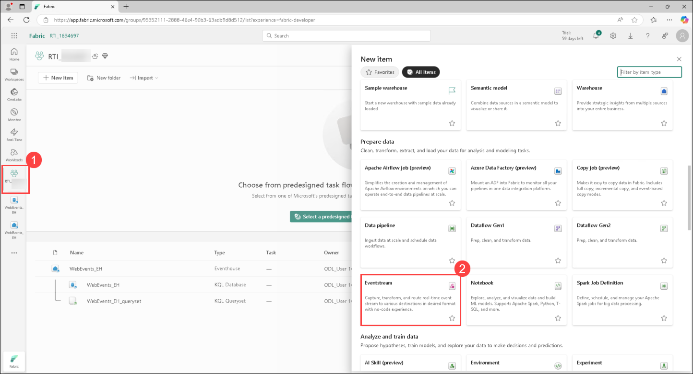

1. Give the Eventstream the name **WebEventsStream_ES (1)**. Make sure that the checkbox **Enhanced Capabilities** is selected and click on **Create (2)**.

    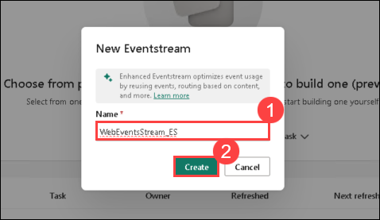

1. On the screen, **Design a flow to ingest, transform, and route streaming events** click on **Use Custom Endpoint.** This will create an event hub connected to the Eventstream.

    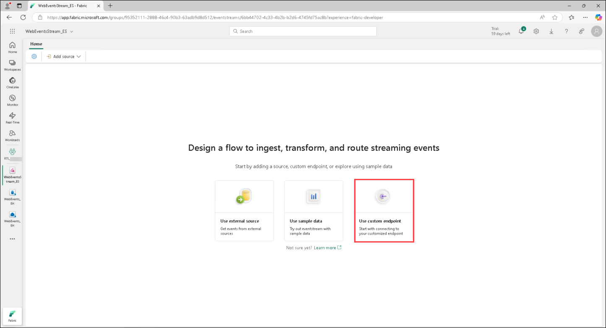

1. Insert `WebEventsCustomSource`(1) as the source name and click **Add (2)**.

    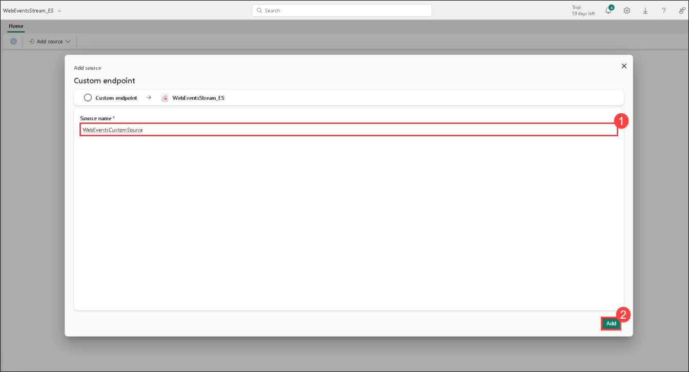

1. Click on **Publish.** The Eventstream will be published, and the Event Hub will be created.

    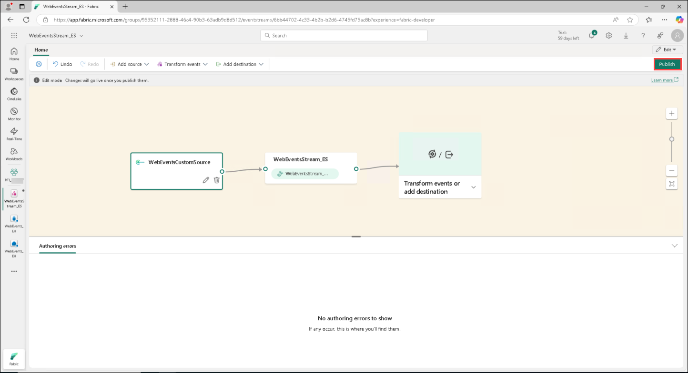

1. To get the information we need for the Notebook, the event hub name, and a connection string, click on the Eventstream source **WebEventsCustomSource**. Click on **SAS Key Authentication (1)** below the diagram. Then click on the copy icon beside the **Event hub name (2)** and paste it into a notepad to use in the later steps. 

    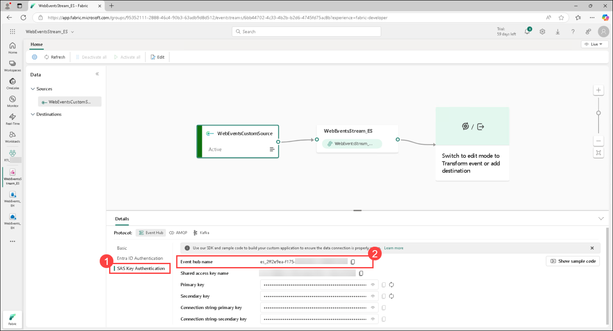

1. To copy the **Connection string,** you must click on the view icon. After the connection string is revealed, click on the copy icon and copy the connection string to Notepad.

    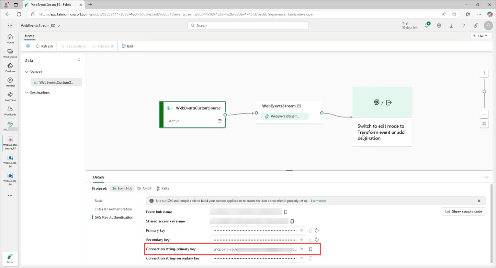

    >**Note:** To copy the connection string, it must be visible.

### Task 2: Import Data Generator Notebook
We use a Python notebook to generate a stream of artificial click events. The notebook can be found in the **C:\LabFiles** directory.

1. Navigate back to your workspace **RTI_<inject key="DeploymentID" enableCopy="false"></inject> (1)** that you have created.

1. Click on **Import (2)**, select **Notebook (3),** and choose **From this computer (4).**

    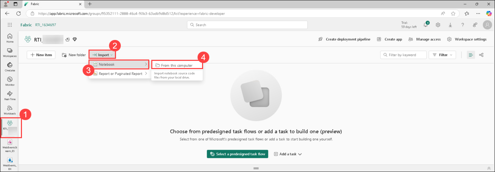

1. In the pane **Import status,** select **Upload** on the right side.

    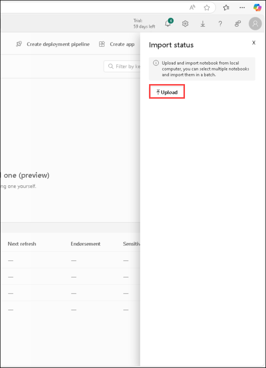

1. Browse the **C:\LabFiles** folder, select the `Generate_synthetic_web_events`(1) notebook, and click on the **Open (2)** button.

    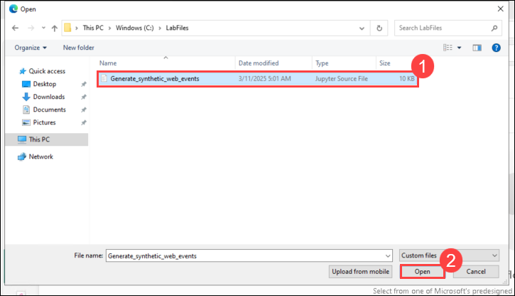

1. After the notebook has been uploaded, Fabric will display a message stating that the notebook has been imported successfully.

### Task 3: Run the Notebook
Now, we have to run the notebook to create a stream of artificial click events for our lab. For the Notebook to send the events to the correct Event Hub, we have to insert the information we have saved in **Task 5 - Create Event Stream.** To run the notebook and create your datastream, please proceed with the following steps.

DO NOT use an InPrivate browser window. It is recommended to use a personal browser window for the Notebook session to connect and run successfully.

1. Click on the Notebook **Generate_synthetic_web_events** in your Fabric Workspace to open it.

    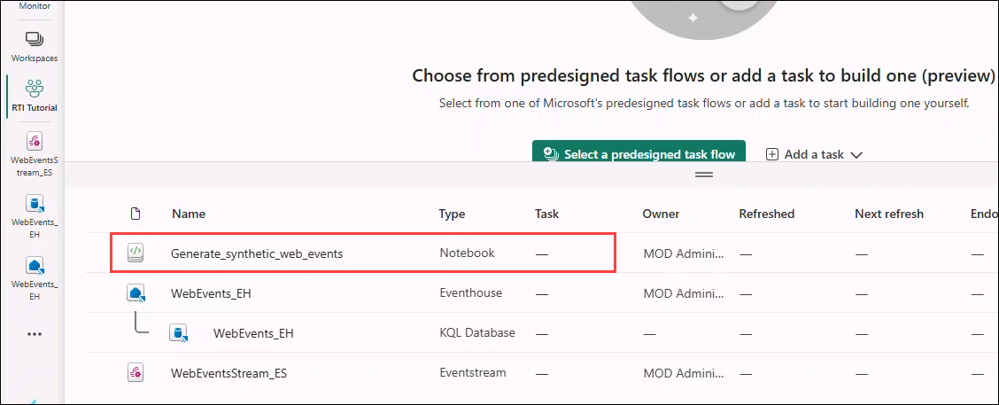

1. Paste the values you copied in **Task 1 - Create Event Stream** as values for `eventHubNameevents` and `eventHubConnString` into the `notebook`.

    

1. Select the **Workspace default (2)** as the **Environment (1)** settings.

    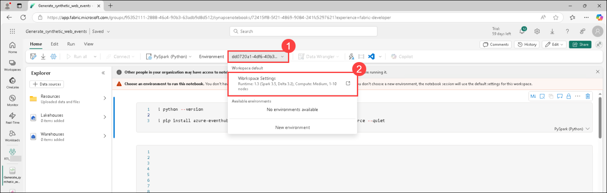

1. Click **Run all** at the top left to start generating streaming events.

    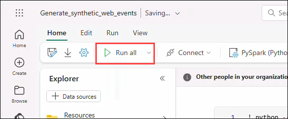

    >**Note:** Errors in Cell 1 may occur due to pre-installed libraries in the environment. These can be safely ignored, as they will not impact the successful execution of the notebook.

    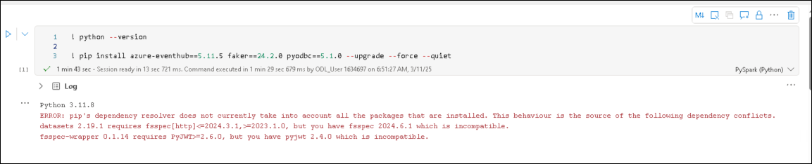
    >**Note:** Wait a few minutes for the first code cell to finish, and automatically proceed to next code cells.

1. Scroll to the last code cell, where the generated synthetic events should begin printing in JSON format. If the output matches the provided screenshot, the notebook will successfully stream artificial click data to the Event Hub. Let the last query run in the background. We will proceed to the next task.
    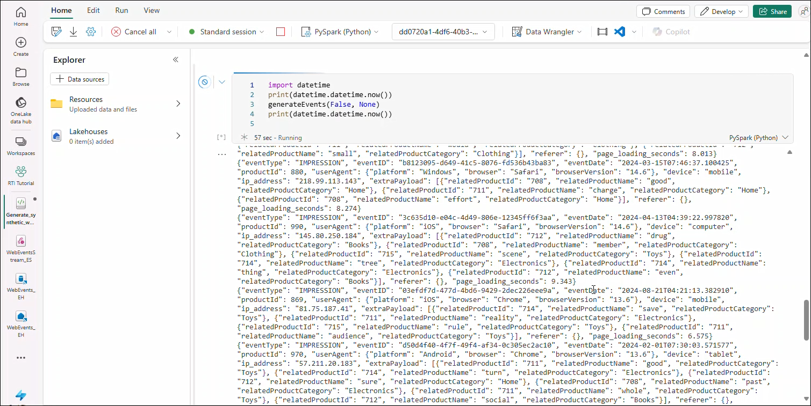

### Task 4: Define Eventstream Topology
In this task, you will create the Eventstream topology to insert the streamed data into your KQL database.

1. Open your Eventstream in your Fabric Workspace by clicking the **RTI_<inject key="DeploymentID" enableCopy="false"></inject> (1)** icon in the left pane and navigating to **Eventstream WebEventStream_ES (2)**.

    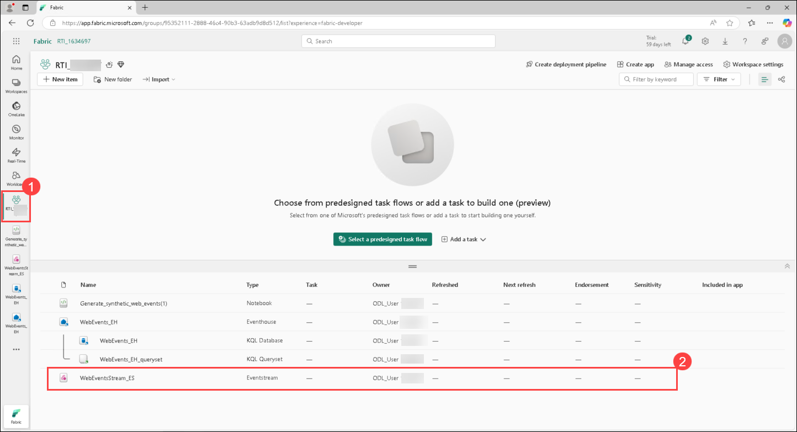

1. Click on **Edit** in the top toolbar.

1. Click on the node **Transform events or add Destination (1)** and select **Filter (2)** from the menu.

    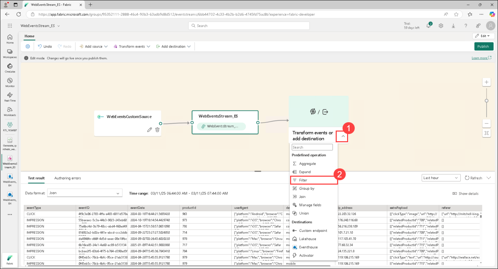

    >**Note**: Check the table at the bottom of the screen to view events streamed by the notebook to the Eventstream.

1. Click on the **pencil icon** in the node **Filter** to enter edit mode.

    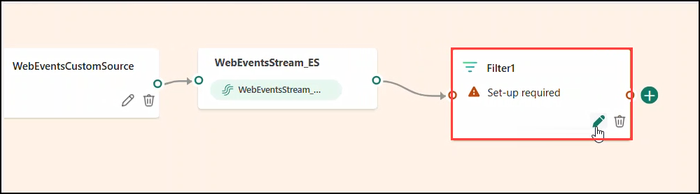

1. Provide the following values in the pane Filter on the left side. Then click on **Save (5)**.

    | Field                  | Value          |
    |------------------------|----------------|
    | Operation name         | ClickEventsFilter (1) |
    | Select a field to filter on | eventType (2)   |
    | Keep events when the value | equals (3)     |
    | value                  | CLICK  (4)        |

    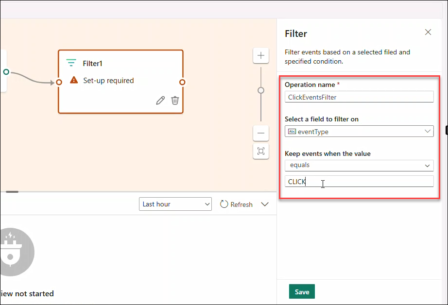
    > **Note:** CLICK is in ALL CAPS.

1. The **ClickEventsFilter** node showing an **error** is expected. This indicates that there is no target for the outgoing data stream, which will be resolved in the next step.

1. Click on the **+ (1)** icon next to the **ClickEventsFilter** node and choose **Stream** from the context menu.

    

1. Choose **Stream** from the context menu.

    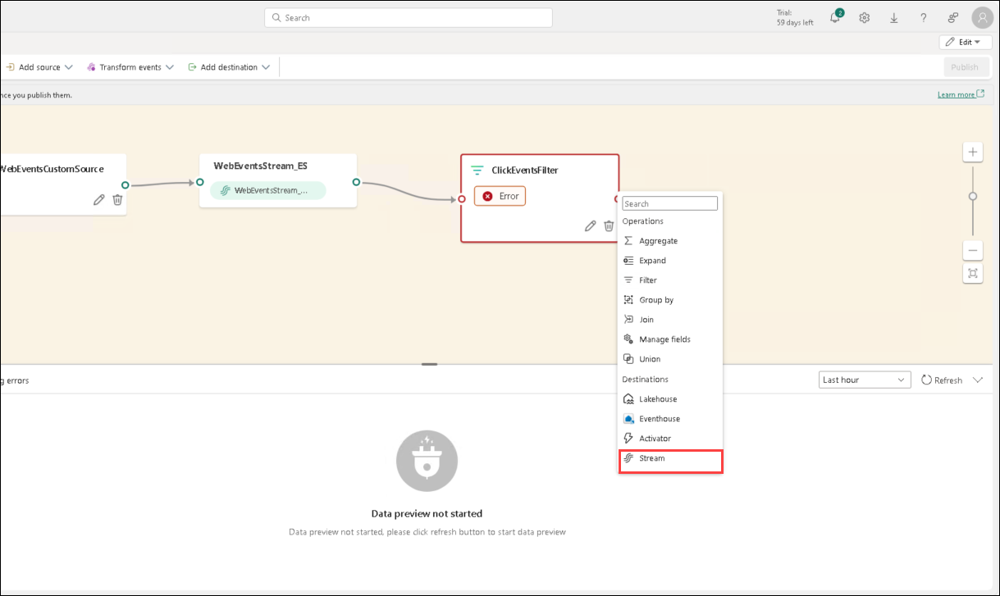

1. Click on the **pencil (1)** in node **Stream** to go to edit mode. Enter `ClickEventsStream`(2) as the name of the Eventstream in the field **Stream name**. Ensure that the **Input data format** is **JSON**. Click on the **Save (3)** button.

    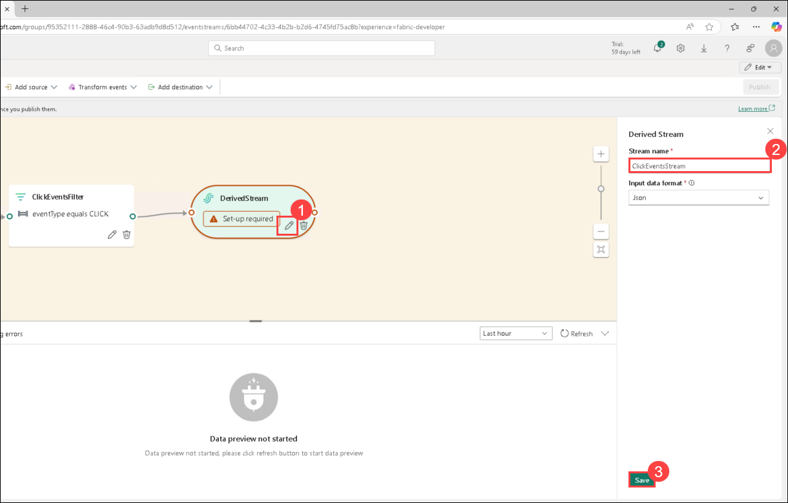

1. Click on the **+** icon next to the node. **ClickEventsStream** and select the **Eventhouse** option in the context menu.

    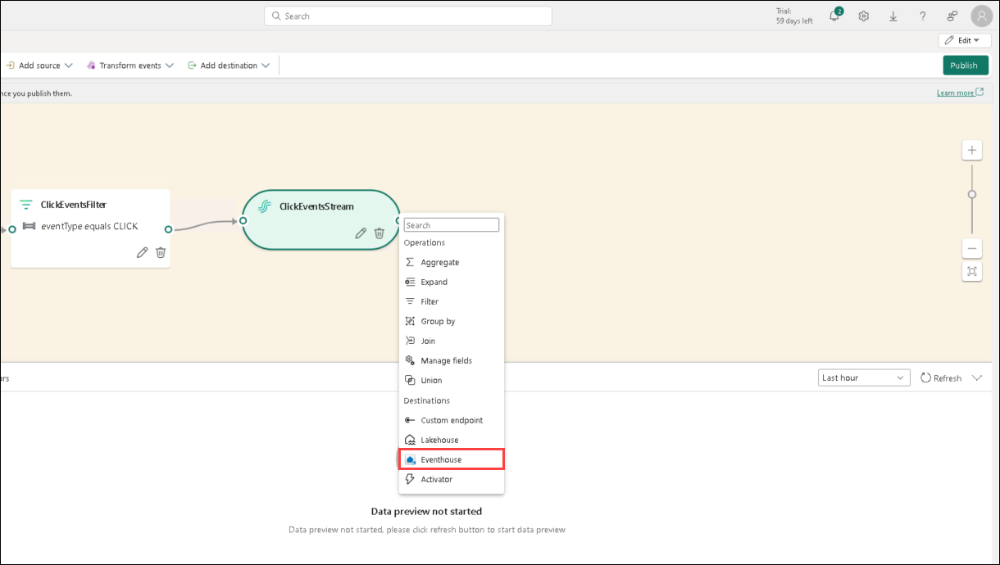

1. Click the pencil in node **Eventhouse (1)** to enter edit mode. Provide the following values in the pane **Eventhouse (2)** and click **Save (3)** after entering all the values.

    | Field                           | Value                                                                                                 |
    |----------------------------------|-------------------------------------------------------------------------------------------------------|
    | Event processing before ingestion| Ensure that this option is selected.                                                                  |
    | Destination name                | ClickEventStore                                                                                       |
    | Workspace                       | Select **RTI_<inject key="DeploymentID" enableCopy="false"></inject>**                                  |
    | Eventhouse                       | Select the Eventhouse WebEvents_EH                                                                     |
    | KQL Database                    | Select the KQL Database WebEvents_EH                                                                   |
    | Destination table               | Click on Create new and enter BronzeClicks as name for the new table and click on Done.               |
    | Input data format               | Ensure that the option Json is selected.                                                              |

    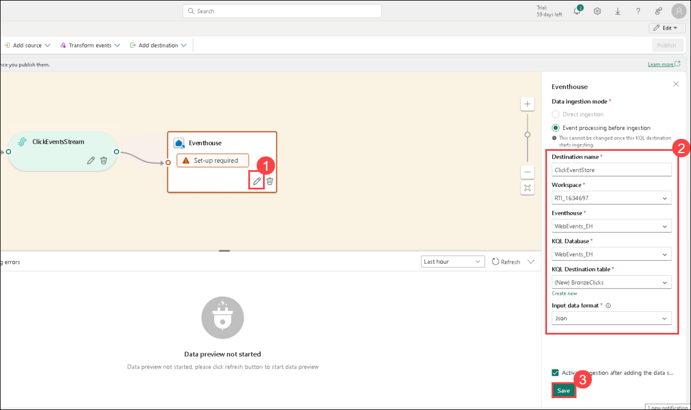

    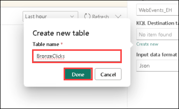

1. Click on the highlighted sign next to the node **WebEventsStream_ES** in the image below.

    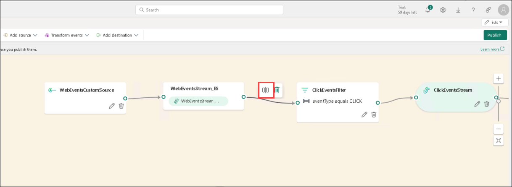

1. Choose the option **Filter** from the context menu.

    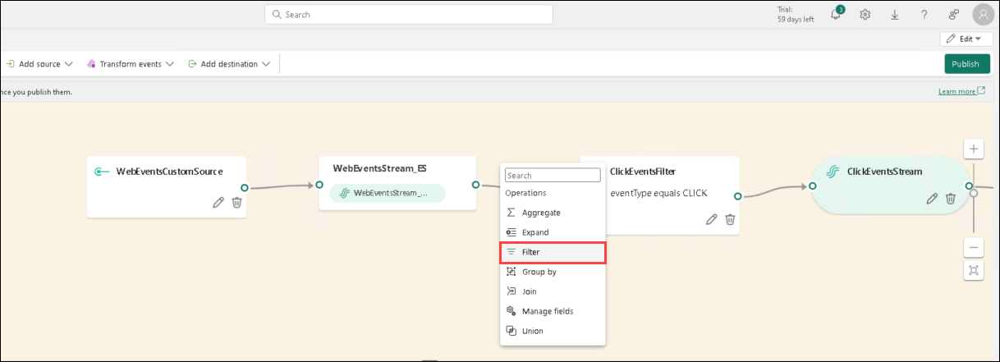

1. Delete the connection between the new filter node **Filter** and the node **ClickEventsFilter** by clicking on the trashcan icon.

    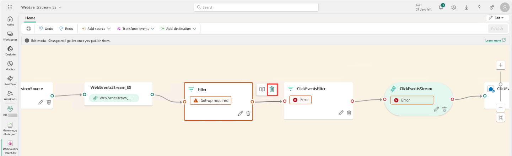

1. Connect the output of the node **WebEventsStream_ES** to the input of the node **ClickEventsFilter**.

    

1. Click on the **pencil** icon of the new node **Filter** to enter edit mode. Provide the following values in the **pane Filter (2)** on the left side. Then click on **Save (2)**.

    | Field                  | Value            |
    |------------------------|------------------|
    | Operation name         | ImpressionEventsFilter |
    | Select a field to filter on | eventType      |
    | Keep events when the value | equals        |
    | value                  | IMPRESSION       |

    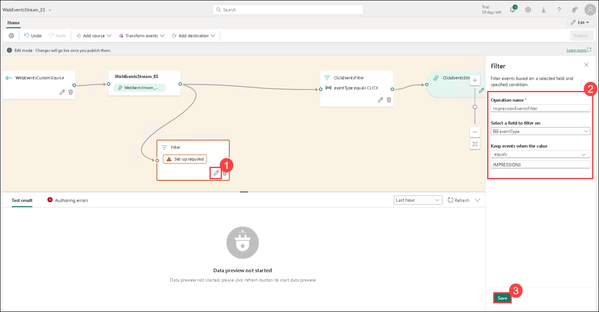

    > **Note:** IMPRESSION is in ALL CAPS.

1. The **ImpressionEventsFilter** node showing an **error** is expected. This indicates no target for the outgoing data stream, which will be resolved in the next step.

1. Click on the **+** sign next to the **ImpressionEventsFilter** node and choose **Stream** from the context menu.

    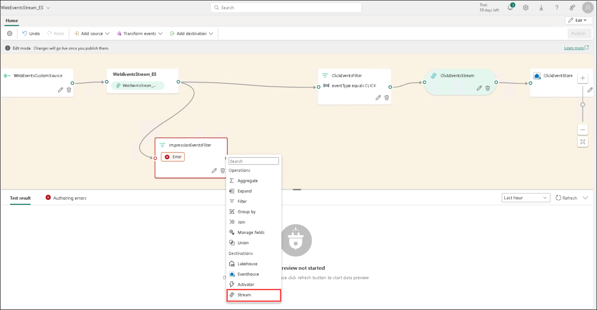

1. Click on the **pencil (1)** icon in the node **Stream** to enter edit mode. Enter `ImpressionsEventsStream`(2) as the name of the Eventstream in the field **Stream name**. Ensure that the **Input** data format is **JSON**. Click on **Save (3)**.

    

1. Click on the **+ icon** next to the node **ImpressionEventsStream** and select **Eventhouse** from the context menu.

    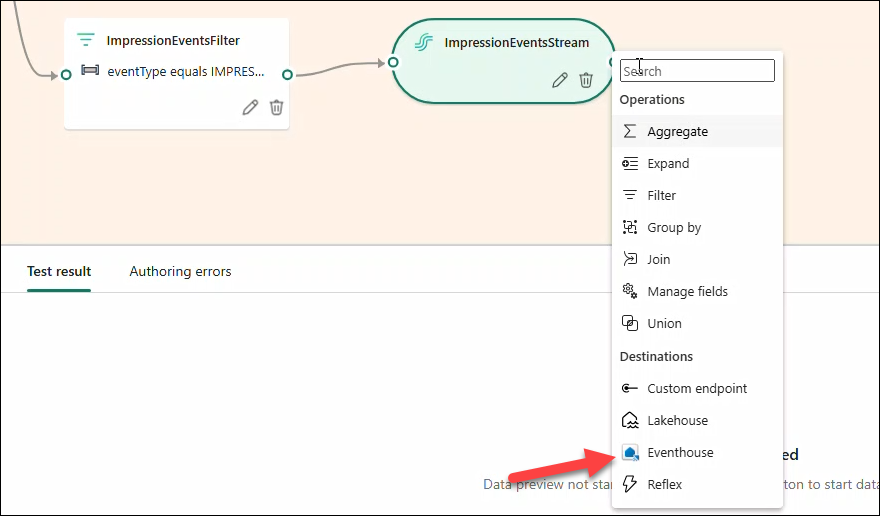

1. Click the **pencil (1)** in node **Eventhouse** to enter edit mode. Provide the following values in the **pane Eventhouse (2)** and click on **Save (3)**.

    | Field                           | Value                                                                                                 |
    |----------------------------------|-------------------------------------------------------------------------------------------------------|
    | Event processing before ingestion| Ensure that this option is selected.                                                                  |
    | Destination name                | ImpressionEventStore                                                                                  |
    | Workspace                       | Select **RTI_<inject key="DeploymentID" enableCopy="false"></inject>**      |
    | Eventhouse                       | Select the Eventhouse WebEvents_EH                                                                     |
    | KQL Database                    | Select the KQL Database WebEvents_EH                                                                   |
    | Destination table               | Click on Create new and enter BronzeImpressions as name for the new table, and click on Done.           |
    | Input data format               | Ensure that the option Json is selected.                                                              |

    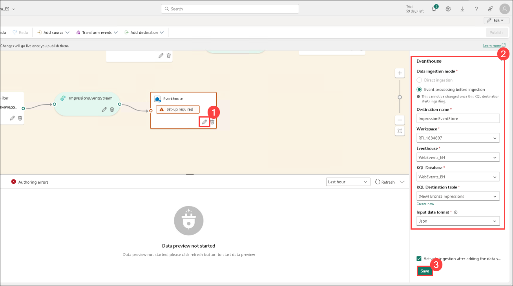

1. Click on the **Publish** button that is located in the toolbar at the top of the screen.

    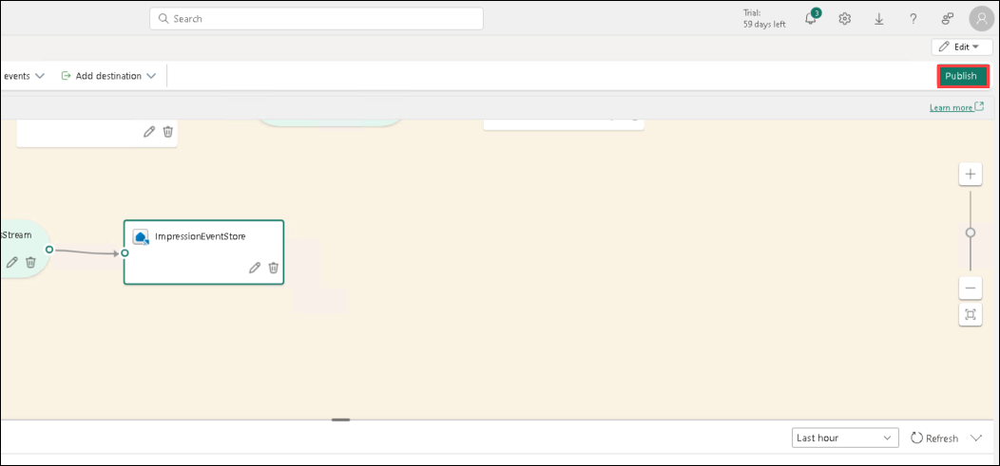

1. After a few minutes, you should see the nodes **ClickEventStore** and **ImpressionEventStore** change to mode **Active**.

    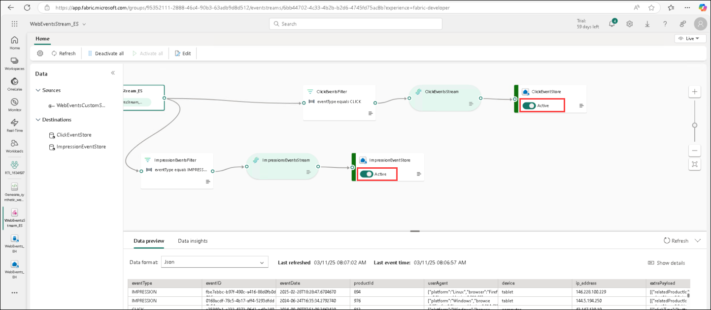

1. In the end, your Eventstream topology should look like the image below.
   
    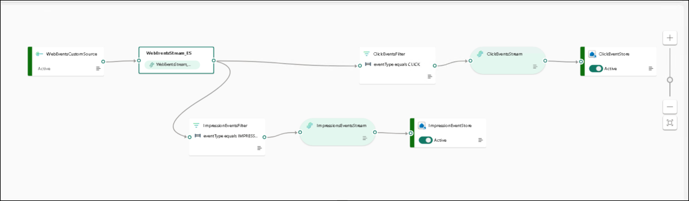

## Review

In this lab, you have completed the following:
- Created a new Eventstream.
- Imported Data Generator Notebook.
- Run the notebook.
- Defined Eventstream topology.

### You have successfully completed the exercise.
