# Build A Fabric Real-Time Intelligence Solution in a Day 
## Estimated duration: 1 hours

### Task 1: Setting up the Lakehouse
In this task, you will set up the Lakehouse that will contain additional information for our usecase and in which you will also make the data from the KQL Database accessible through the lakehouse.

1. To create a **Lakehouse**, first return to your assigned workspace by clicking on its icon in the left toolbar.

    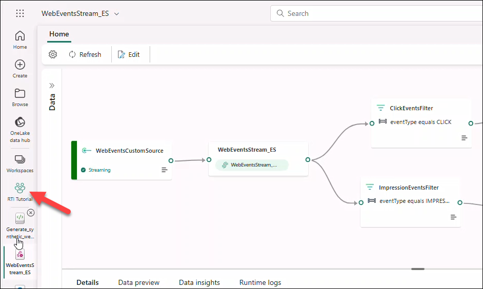

1. Click on the button **+ New Item** in the toolbar and in the popin window click on the tile **Lakehouse**.

    

1. In the dialog **New lakehouse** enter `WebSalesData_LH` as name for the new lakehouse. Ensure that the checkbox **Lakehouse schemas (Public Preview)** is not checked. Then click on the button **Create**

    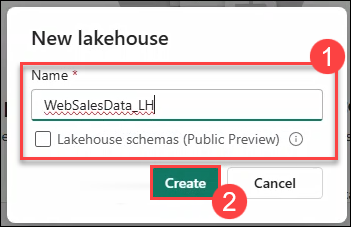

### Task 2: Create delta tables in the lakehouse
After our lakehouse has been created the overview page of the lakehouse will be displayed. Next task we have to accomplish is to load static data into our new lakehouse. To do so please execute the following steps.

1. Click on the button **Get data** in the toolbar and select **Upload Files** from the dropdown menu.

    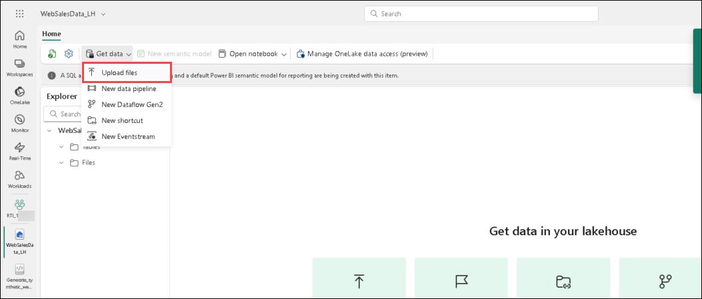

1. To upload the two files navigate to `C:\LabFiles` and select the two files **products.csv** and **productcategory.csv**. Then click on the button **Open**.

    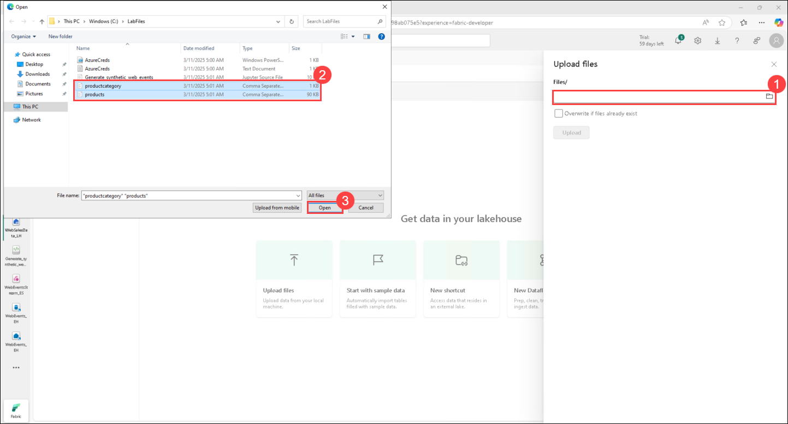

    >**Note:** To select the two files at once you can just hold the key CTRL while you click the two files.

1. In the popin window **Upload files** click on the button **Upload**. Now the files will be uploaded.

    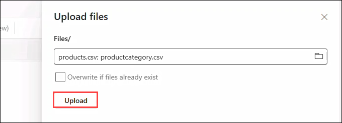

1. To check that the files have been uploaded successfully, click on the folder **Files** in the pane **Explorer**. You should see the files in the list **Files** in the right part of the window.

    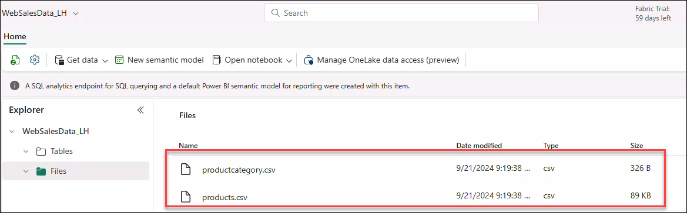

1. Next we have to create delta tables in our Lakehouse from the files we uploaded. To do this access the context menu by clicking on the three dots (...). Select **Load to tables** from the context menu and in the submenu click on **New table**

    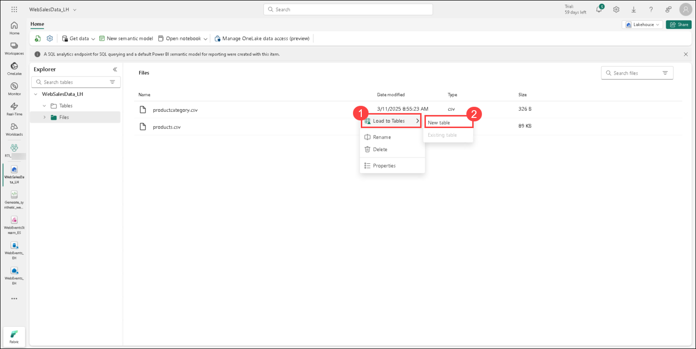

1. Retain all default values and click on the button **Load**.

    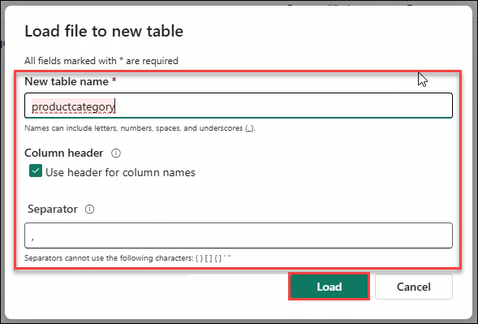
    >**Note:** This steps have to be executed for the file productcategory.csv as well as for the file product.csv.

1. Ensure that both files **products.csv** and **productcategory.csv** are available as delta tables in your lakehouse. Your lakehouse should look like this:

    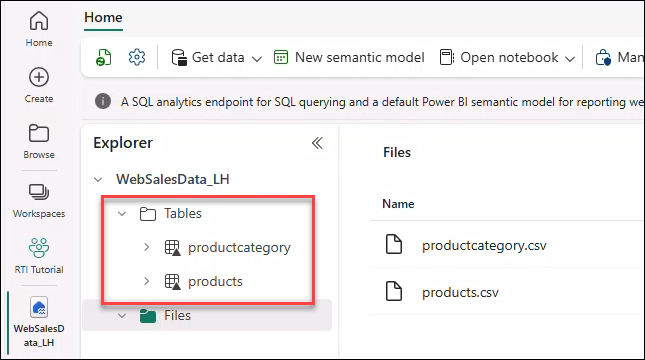

### Task 3: Accessing Eventhouse data from the lakehouse 
In this task, you will make the Eventhouse tables form the KQL Database available in our Lakehouse. This will be accomplished by creating shortcuts.

1. Click on the button **Get data** in the menu bar at the top. Choose **New shortcut** from the dropdown menu.

    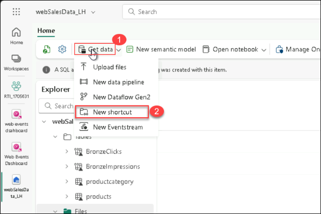

    >**Note:** If your Lakehouse is using Schemas you will see the schema dbo under the folder Tables. right-click the schema dbo and select the option New table shortcut from the context menu.

1. Select **Microsoft OneLake**.

    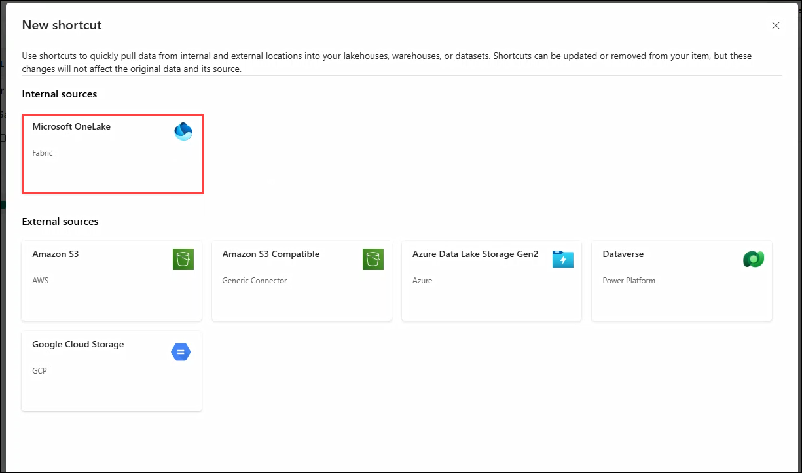

1. Select the KQL Database **WebEvents_EH** in the Window **Select a data source type** and click on the button **Next**.

    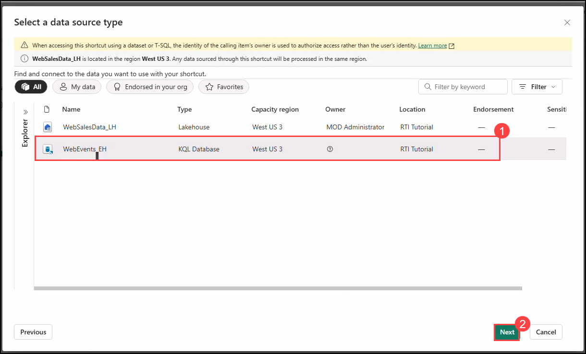

1. Expand the folder **Tables** under **WebEvents_EH** in the window **New shortcut** and check both tables **BronzeClicks** and **BronzeImpressions**. Click on **Next**.

    

1. You may return to this step to create additional shortcuts, after running the **createAll.kql** database script which will create additional tables. For now, you may proceed by selecting just the **BronzeClicks** and **BronzeImpressions** tables.

1. Click on the **Create** button.

    

1. Now you can see the shortcuts to the tables **BronzeClicks** and **BronzeImpressions** under the folder **Tables** in the lakehouse **WebSalesData_LH**.

    

### Task 4: Build the KQL DB schema
In this task, you will create all the silver tables, functions and enable update policies and in our Eventhouse KQL Database. Two of the tables (`product` and `productCategory)` are shortcuts to the lakehouse and the data is **NOT** being copied into our KQL Database.

1. Open the KQL Database **WebEvents_EH** in the Eventhouse of your Fabric Workspace. To do so click on the Icon of the Eventhouse in the left toolbar.

    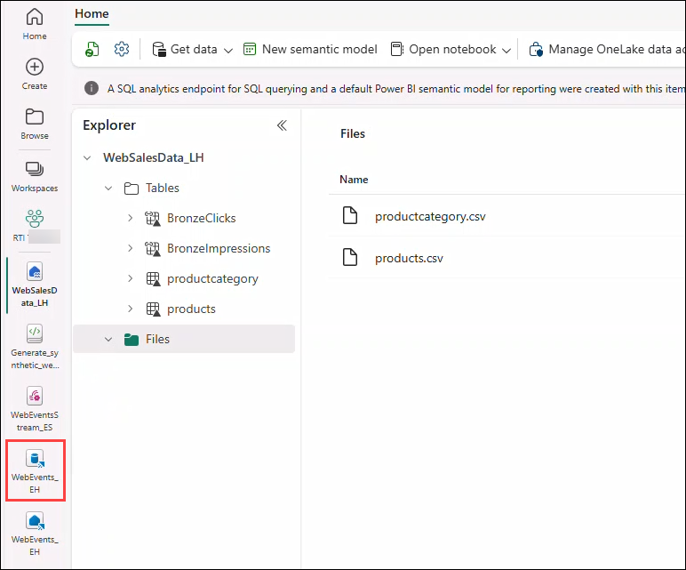

1. Click on the button **+ New** in the top toolbar and choose **OneLake shortcut** from the drop down menu.

    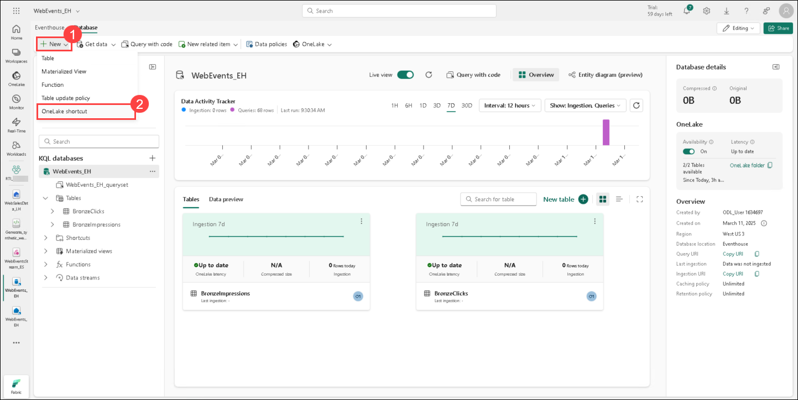

1. By now data has already streamed into you KQL-Database. You can see this by looking at the dashborad that is provided on the overview page of the KQL-Database    

    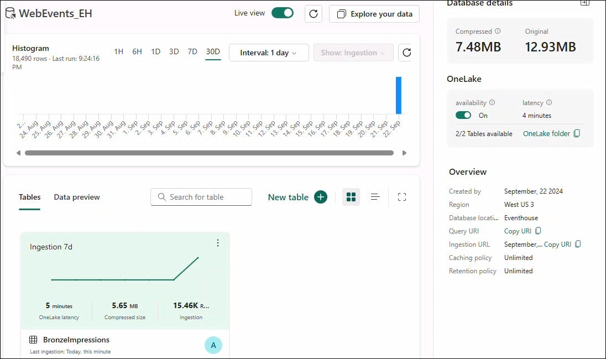

1. Select **Microsoft OneLake**.

    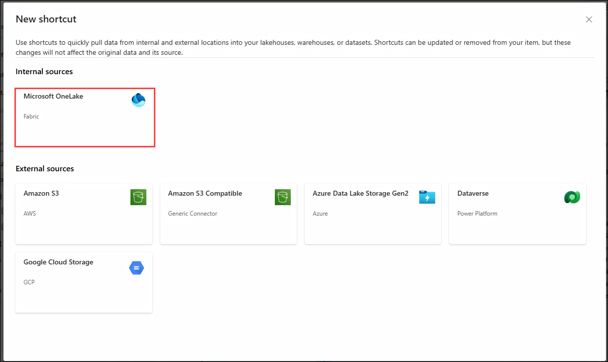

1. Select the lakehouse **WebSalesData_LH** and click on the button **Next**.

    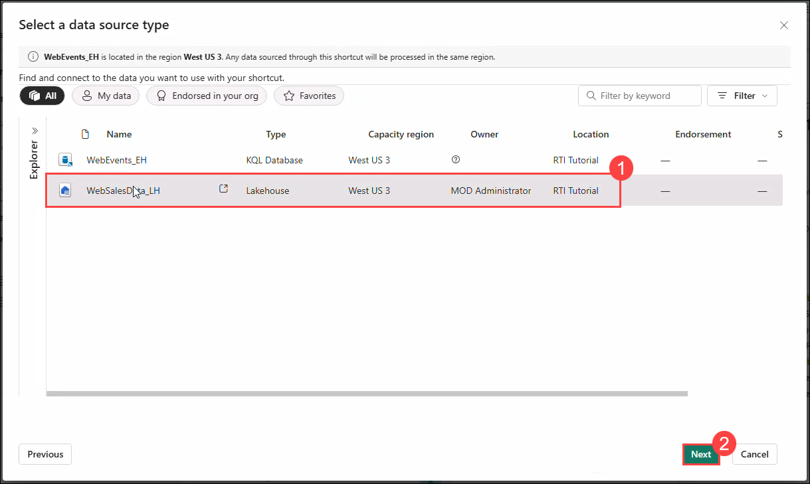

1. Expand the folder **Tables**, select the table **products** table and click on the button **Create**. This will create a shortcut to the table **products** in your Lakehouse without copying the data from the Lakehouse to Eventhouse.

    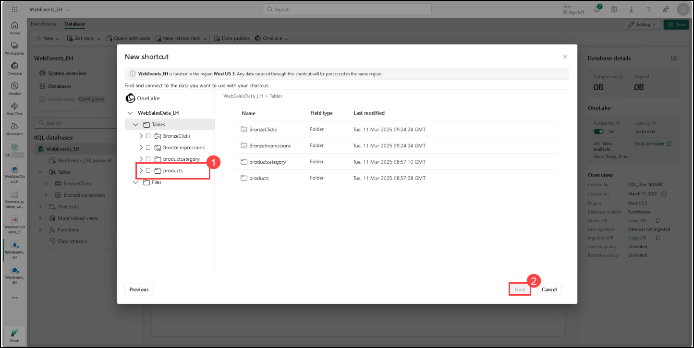

1. Repeat the steps above for the table **productcategory** to create a shortcut for this table as well.

1. Expand the folder **Shortcuts** in the tree of your Eventhouse **WebEvents_EH** to verify if the 2 shortcuts have been created correctly.

    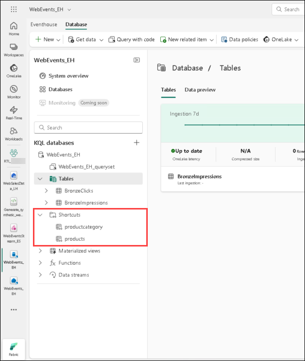

1. Click on the button **Query with code** at the top of the screen.

    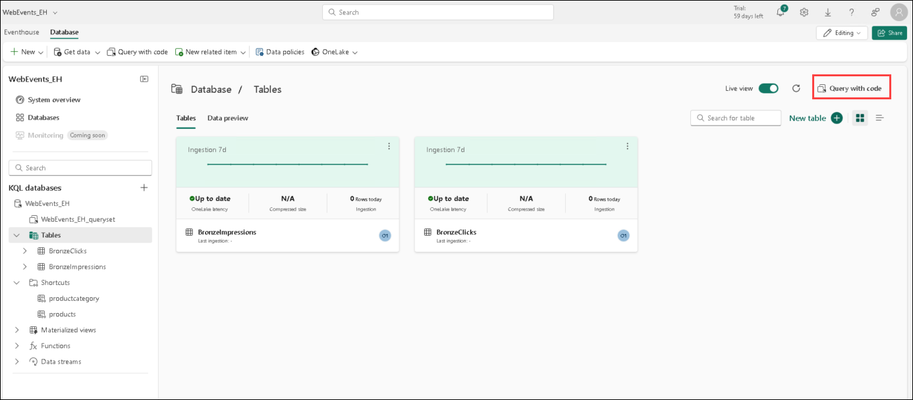

1. The popin window **Query with code** will be shown.

    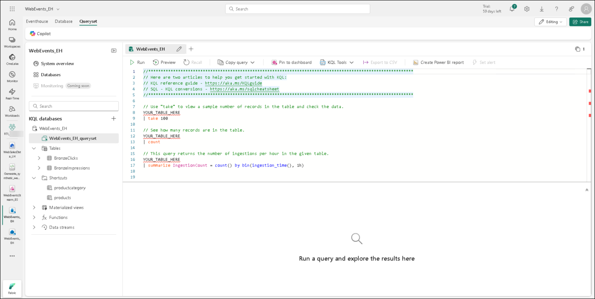

1. Copy the below code, and paste it into the the Queryset and **Run** it.

    ```kusto
    .execute database script <|
    //SILVER LAYER
    .create table SilverClicks (
        eventType:string, 
        eventID:string, 
        eventDate:datetime, 
        productId:long, 
        userAgent:dynamic, 
        device:string, 
        ip_address:string, 
        referer:dynamic, 
        page_loading_seconds:real, 
        clickType:string, 
        clickPathTitle:string, 
        clickPathUrl:string
    )
    //
    .create table SilverImpressions (
        eventType:string, 
        eventID:string, 
        eventDate:datetime, 
        productId:long, 
        userAgent:dynamic, 
        device:string, 
        ip_address:string, 
        page_loading_seconds:real, 
        relatedProductCategory:string, 
        relatedProductId:string, 
        relatedProductName:string
    )
    // use update policies to transform data during Ingestion
    .create-or-alter function with (folder="Bronze to Silver Transformations") expandClickpath()
    {
    BronzeClicks
    | mv-expand extraPayload
    | evaluate bag_unpack(extraPayload)
    | project 
        eventType, 
        eventID, 
        todatetime(eventDate), 
        productId, 
        userAgent, 
        device, 
        ip_address, 
        referer, 
        toreal(page_loading_seconds), 
        clickType = clickType, 
        clickPathTitle = ['title'], 
        clickPathUrl = url
    }
    //
    .alter table SilverClicks policy update @'[{"Source": "BronzeClicks", "Query": "expandClickpath", "IsEnabled" : true, "IsTransactional": false }]'
    //
    .create-or-alter function with (folder="Bronze to Silver Transformations") expandRelatedProducts()
    {
    BronzeImpressions
    | mv-expand extraPayload
    | evaluate bag_unpack(extraPayload)
    | project 
        eventType, 
        eventID, 
        todatetime(eventDate), 
        productId, 
        userAgent, 
        device, 
        ip_address, 
        toreal(page_loading_seconds), 
        relatedProductCategory, 
        relatedProductId, 
        relatedProductName
    }
    //
    .alter table SilverImpressions policy update @'[{"Source": "BronzeImpressions", "Query": "expandRelatedProducts", "IsEnabled" : true, "IsTransactional": false }]'
    //
    .create-or-alter function with (docstring = "Social Media Campaign Clickstream", folder = "Gold Views") SocialMediaCampaignClickstream()
    {
    SilverClicks
    | extend CampaignType = tostring(referer.campaignType)
    | extend Platform = tostring(userAgent.platform)
    | extend Browser = tostring(userAgent.browser)
    | extend RefererUrl = tostring(referer.url)
    | extend AdTitle = tostring(referer.adTitle)
    | where CampaignType in ("facebook", "twitter", "instagram", "pinterest")
    | project-away userAgent, referer
    | project-reorder CampaignType
    }
    //
    .create-or-alter function with (docstring = "Search Media Campaign Clickstream", folder = "Gold Views") SearchMediaCampaignClickstream()
    {
    SilverClicks
    | extend CampaignType = tostring(referer.campaignType)
    | extend Platform = tostring(userAgent.platform)
    | extend Browser = tostring(userAgent.browser)
    | extend RefererUrl = tostring(referer.url)
    | extend AdTitle = tostring(referer.adTitle)
    | where CampaignType in ("google", "bing")
    | project-away userAgent, referer
    | project-reorder CampaignType
    }
    //
    .create-or-alter function with (docstring = "Email Campaign Clickstream", folder = "Gold Views") EmailCampaignClickstream()
    {
    SilverClicks
    | extend CampaignType = tostring(referer.campaignType)
    | extend Platform = tostring(userAgent.platform)
    | extend Browser = tostring(userAgent.browser)
    | extend RefererUrl = tostring(referer.url)
    | extend EmailId = tostring(referer.emailId)
    | where CampaignType in ("email")
    | project-away userAgent, referer
    | project-reorder CampaignType
    }
    ```

    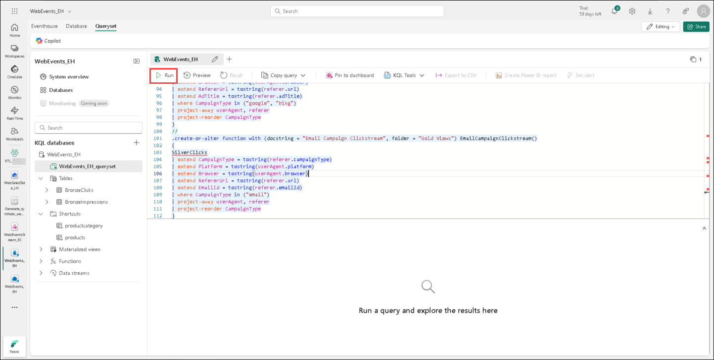

1. The status of the execution of the commands from the file **createAll.kql** can be seen at the bottom of the pane. The result of each Command should be **Completed**.

    

1. Click on the pencil at the tab **WebEvents_EH** and rename the tab to **createAll**.

    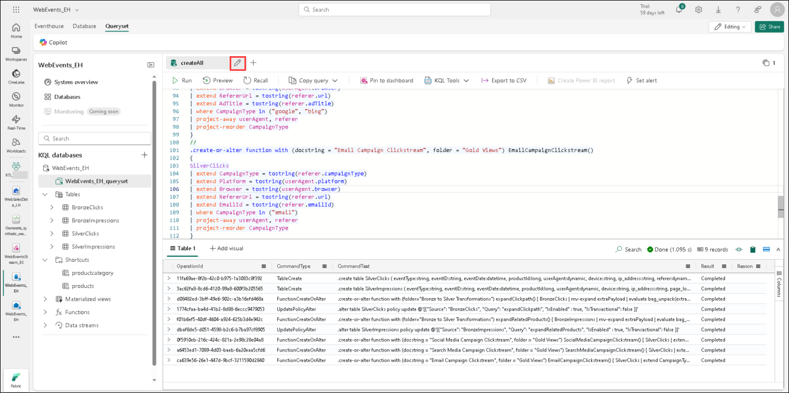

1. Expand all folders in the database pane on the left. All tables and functions that have been created by the script can be found here.

    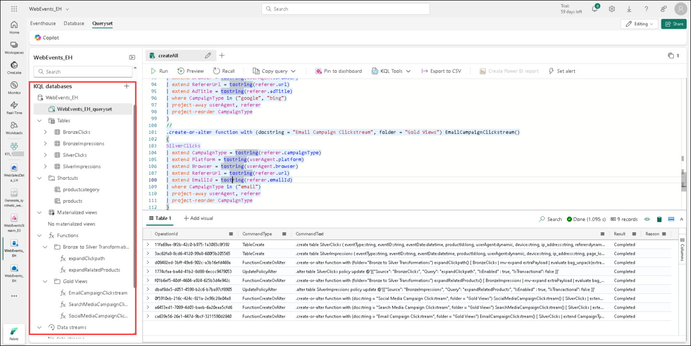
