# Exercise 04: Building an Interactive Real-Time Dashboard with Live Data
### Estimated duration: 180 minutes
In this exercise, you will develop a **Real-Time Dashboard** with auto-refresh for live insights. Finally, you will use **Data Activator** to automate actions based on real-time data.

## Lab objectives: 
In this lab, you will be able to complete the following tasks:

- Task 1: Real-Time Dashboard. 
- Task 2: Enable Auto-refresh to your dashboard.  
- Task 3: Enable Data Activators.

### Task 1:  Real-Time Dashboard 

In this task, you will build a real-time dashboard to visualize the streaming data and set it to refresh every 30 seconds. (Optionally) A pre-built version of the dashboard is available to download here, which can be imported and configured to your KQL Database data source.

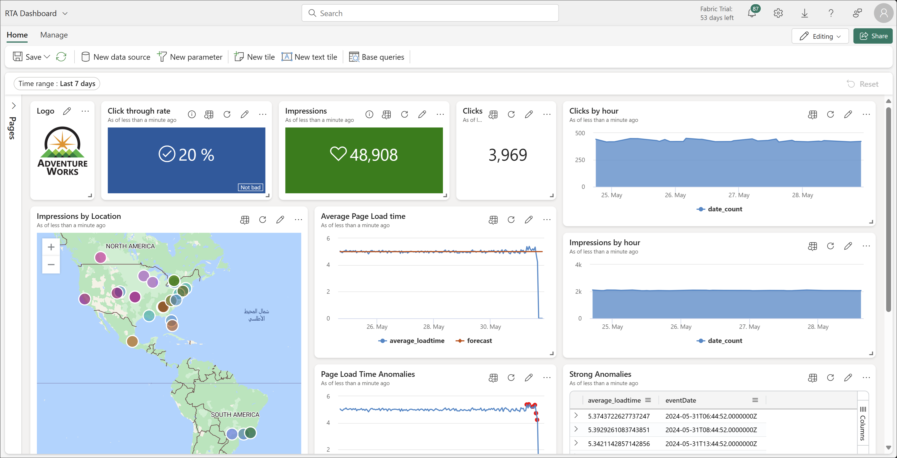

1. Switch to your workspace **RTI_<inject key="DeploymentID" enableCopy="false"></inject>** by clicking on its icon in the left pane.

    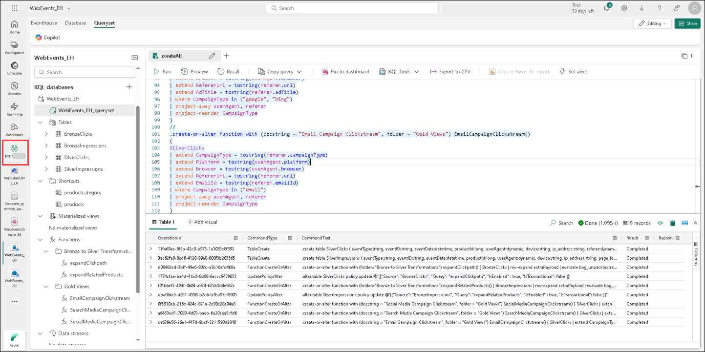

1. To create a new realtime dashboard click on the button **+ New Item  (1)** and the select **Real-Time Dashboard  (2)**.

    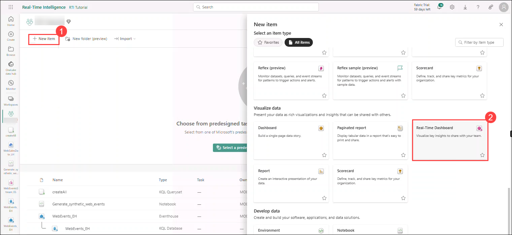

1. Enter the name as **Web Events Dashboard** in the field **New Real-Time Dashboard**. Then click on **Create**.

    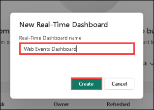

1. An empty dashboard will be displayed. To add a visualisation click on the button **+ Add tile**.

    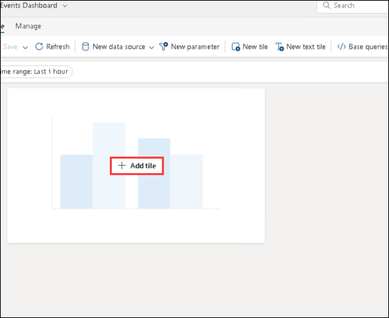

1. Click on the Button **Data source  (1)** and select **Eventhouse/KQL Database  (2)**.

    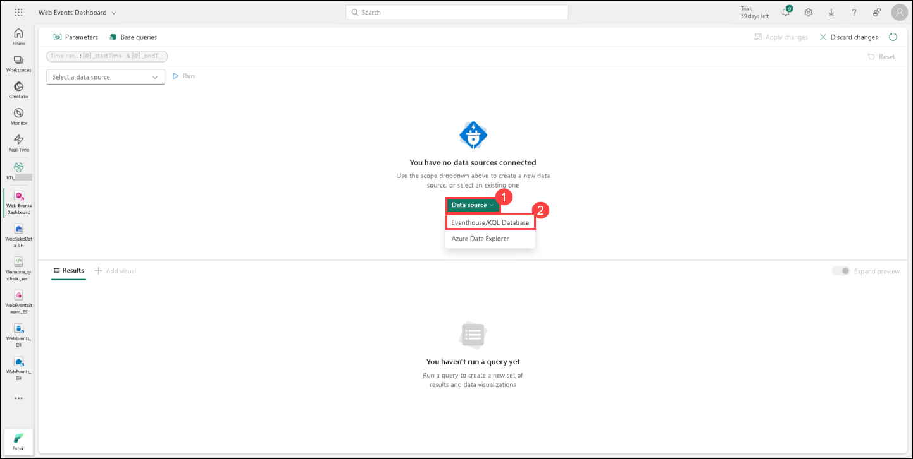

1. In the Window **One Lake Data Hub** select the Eventhouse **WebEvents_EH  (1)**. Then click on **Connect  (2)**.

    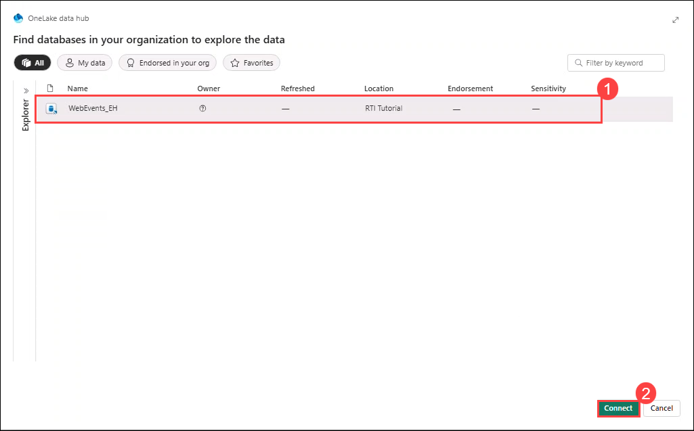

1. Use **WebEvents_EH** as the name, set the database to **WebEvents_EH**, and click **Add**.

    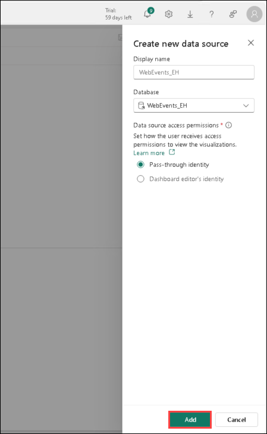

1. Proceed to paste each query below, add a visual, and apply changes.

1. This visual will show the **Clicks by hour**. It will use the following query.

    ```kusto
    SilverClicks
    | where eventDate between (_startTime.._endTime)
    | summarize date_count = count() by bin(eventDate, 1h)
    | render timechart
    | top 30 by date_count
    ```

1. Replace the content of the textbox by the code above. Click on the time range parameter at the top of the screen and set it to **Last 7 days  (1)**. This parameter is referenced by the query in the `where` clause by using fields `_startTime` and `_endTime`. Click on the button **Run  (2)**. The query will be executed and the results will be shown in the table at the bottom. To create a visualisation click on the button **+ Add Visual  (3)**. This will open a pane at the right side of the browser.

    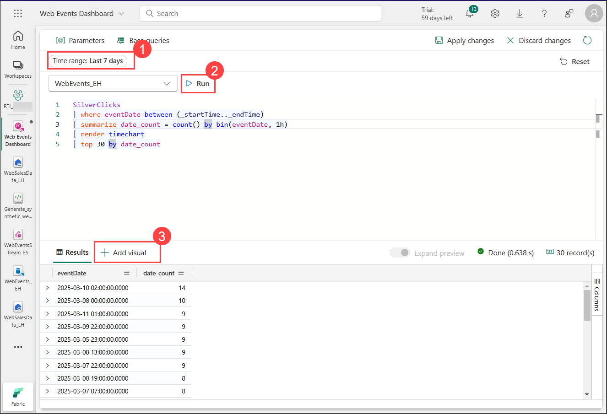

1. Format the visual by entering `Click by hour` (1) in the field **Title**. Select **Area chart  (2)** in the combobox **Visual type.** Then click on the button **Apply changes  (3)**.

    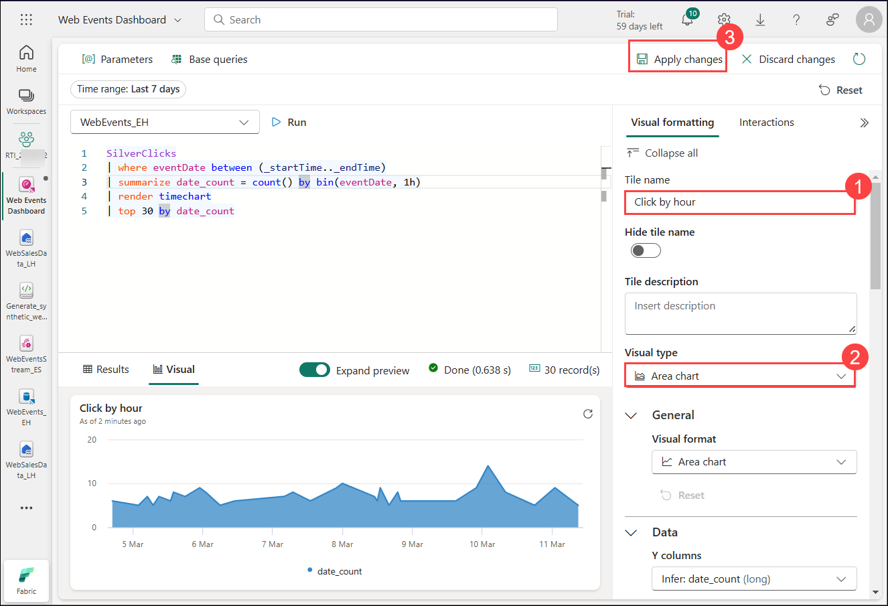

1. While editing the dashboard, click on the tab **Manage  (1)** on the top left then click on the button **Parameters  (2)**.

    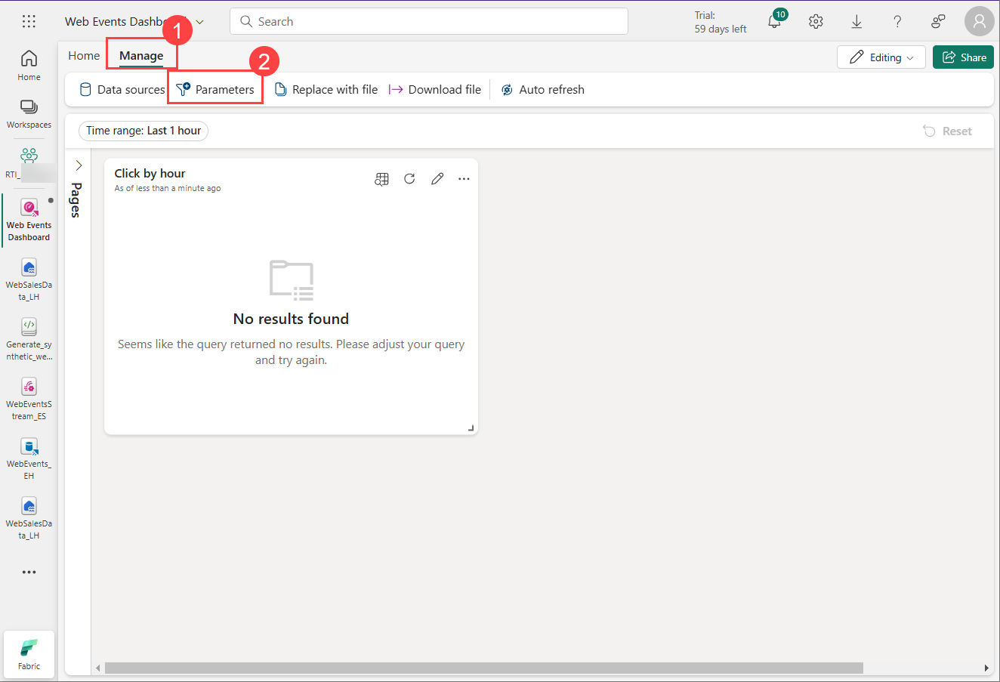

1. To edit the parameter **Time range** click on the pencil icon. This will enter the edit mode for this parameter.

    

1. Select **Last 7 Days  (1)** in the combo box **Default value**. Then click on **Done (2)**.

    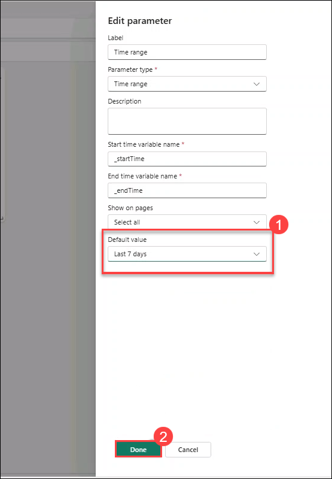

1. In the parameter pane click on the button **Close**.


1. Click on the tab **Home** and then click on the button **New tile** again to proceed with the next visuals.

    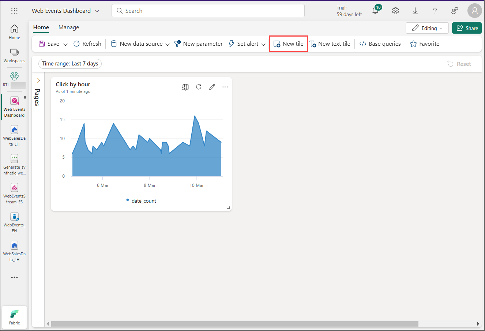

1. We will create an **Impressions by hour** visualization with an **Area chart** as the visual type  using the following query.

    ```kusto
    //Impressions by hour
    SilverImpressions
    | where eventDate between (_startTime.._endTime)
    | summarize date_count = count() by bin(eventDate, 1h)
    | render timechart
    | top 30 by date_count
    ```
    

1. Create an **Impressions by location** visualization in a new tile with **Map** as the visual type using the following query.

    ```kusto
    //Impressions by location
    SilverImpressions
    | where eventDate  between (_startTime.._endTime)
    | join external_table('products') on $left.productId == $right.ProductID
    | project lon = toreal(geo_info_from_ip_address(ip_address).longitude), lat = toreal(geo_info_from_ip_address(ip_address).latitude), Name
    | render scatterchart with (kind = map) //, xcolumn=lon, ycolumns=lat)
    ```

   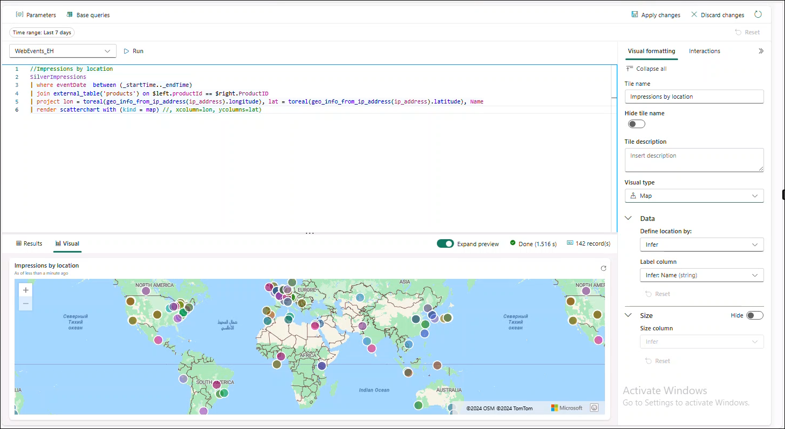

1. Create an **Average Page Load Time** visualization in a new tile with **Timechart** as the visual type using the following query.

    ```kusto
    //Average Page Load time
    SilverImpressions
    | where eventDate   between (_startTime.._endTime)
    //| summarize average_loadtime = avg(page_loading_seconds) by bin(eventDate, 1h)
    | make-series average_loadtime = avg(page_loading_seconds) on eventDate from _startTime to _endTime+4h step 1h
    | extend forecast = series_decompose_forecast(average_loadtime, 4)
    | render timechart
    ```

   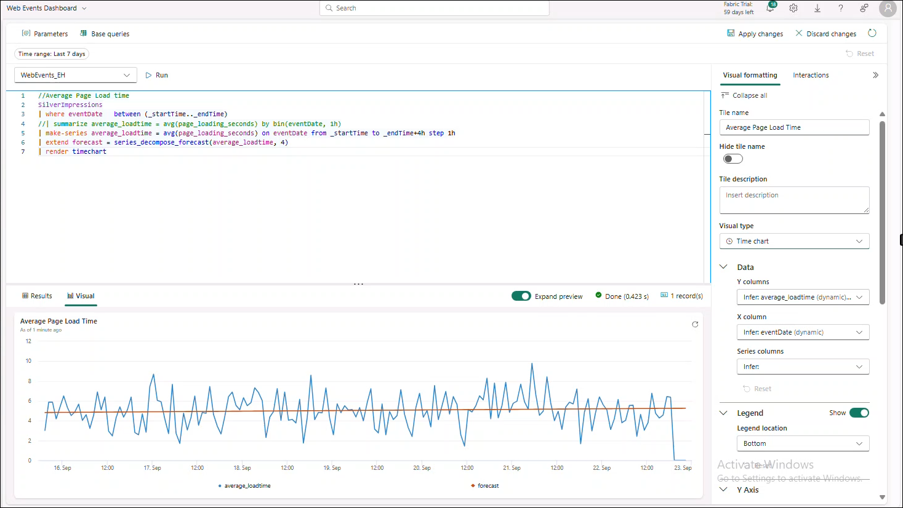

1. Add a tile for **Impressions, Clicks & CTR**, then paste the multi-statement query below, which uses multiple **let** statements combined with semicolons.

    ```kusto
    //Clicks, Impressions, CTR
    let imp =  SilverImpressions
    | where eventDate  between (_startTime.._endTime)
    | extend dateOnly = substring(todatetime(eventDate).tostring(), 0, 10)
    | summarize imp_count = count() by dateOnly;
    let clck = SilverClicks
    | where eventDate  between (_startTime.._endTime)
    | extend dateOnly = substring(todatetime(eventDate).tostring(), 0, 10)
    | summarize clck_count = count() by dateOnly;
    imp
    | join clck on $left.dateOnly == $right.dateOnly
    | project selected_date = dateOnly , impressions = imp_count , clicks = clck_count, CTR = clck_count * 100 / imp_count
    ```

1. Enter **Impressions (1)** in the *field Tile name*. Select **Stat (2)** in the *combobox Visual type*. In combobox *Data Value column* select **impressions (long) (3)**. Then click on the button Apply changes.

    

1. Click the 3-dots (...)  (1) at the top right of the tile you just created and select **Duplicate  (2)** from the **title options  (2)** to duplicate it two more times.

    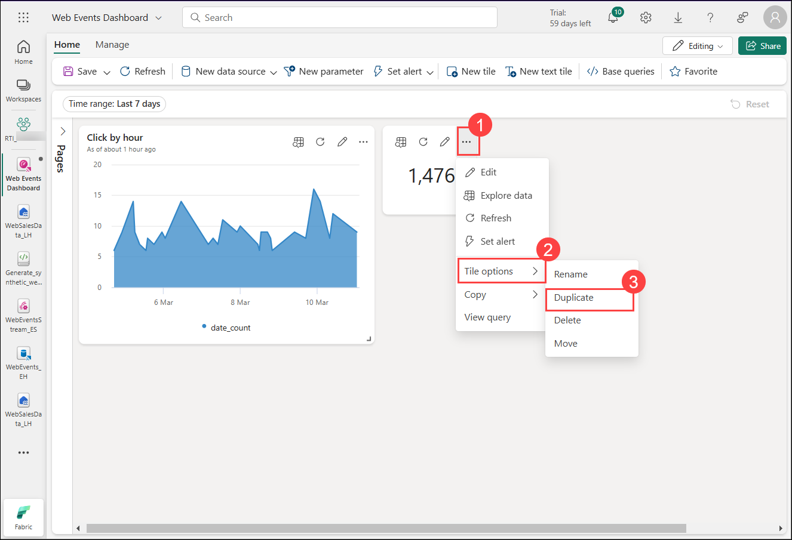

1. Name the 2nd one **Clicks (1)**, set the Data value column to **clicks (long) (2)**, then click on the button **Apply changes (3)**.

    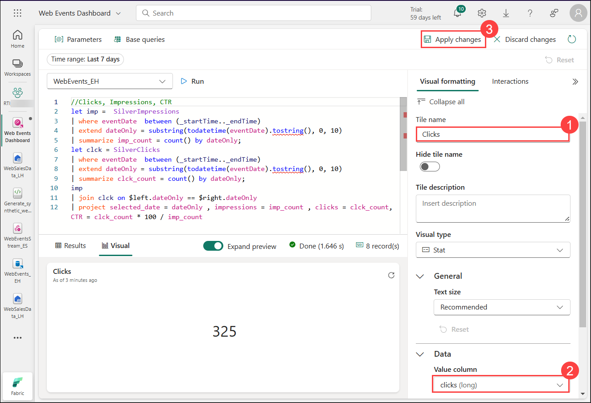

1. Name the 3rd **Click Through Rate (1)**, set the *Data value* column to **CTR (2)**, then click on the button **Apply changes (3)**.

    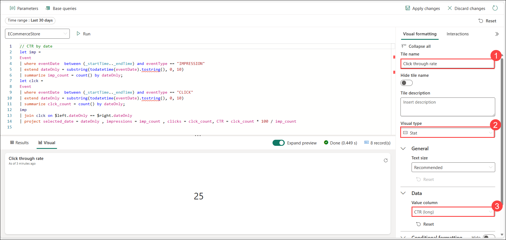

1. Create an **Average Page Load Time Anomalies** visualization with an **Anomaly chart** as the visual type using the following query.

    ```kusto
    //Avg Page Load Time Anomalies
    SilverImpressions
    | where eventDate   between (_startTime.._endTime)
    | make-series average_loadtime = avg(page_loading_seconds) on eventDate from _startTime to _endTime+4h step 1h
    | extend anomalies = series_decompose_anomalies(average_loadtime)
    | render anomalychart
    ```

   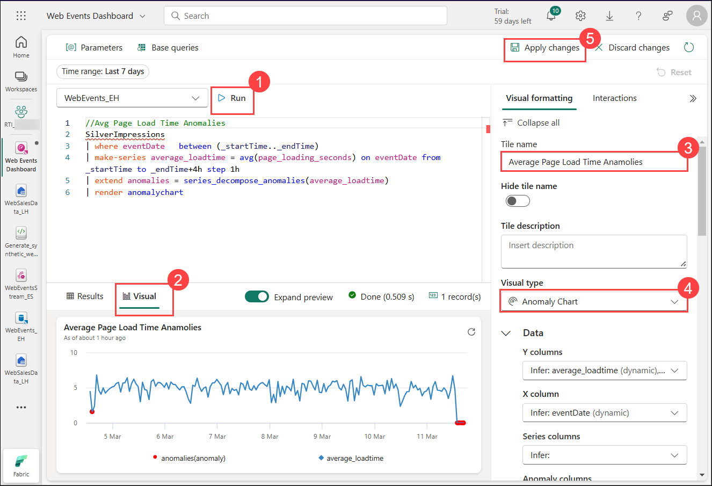

1. Create a **Strong Anomalies** visualization with a **Table** as the visual type using the following query.

    ```kusto
    //Strong Anomalies
    SilverImpressions
    | where eventDate between (_startTime.._endTime)
    | make-series average_loadtime = avg(page_loading_seconds) on eventDate from _startTime to _endTime+4h step 1h
    | extend anomalies = series_decompose_anomalies(average_loadtime,2.5)
    | mv-expand eventDate, average_loadtime, anomalies
    | where anomalies <> 0
    | project-away anomalies
    ```

1. To add a **Logo**, click on the **New text tile** button in the top toolbar.

    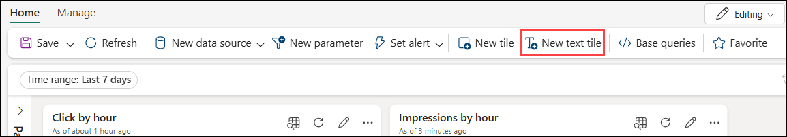

1. **Paste  (1)** the following code in the text area and click on the button **Apply changes  (2)**.

    ```kusto
    //Logo (Markdown Text Tile)
    
    ```
   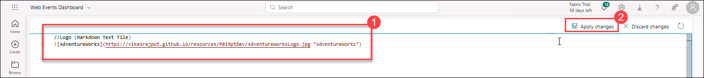
   >**Note:** The title can be resized on the dashboard canvas directly, rather than writing code.

1. After you added all the visuals and moved them to thier appropiate places your dashboard should look similar to the below image.

    

### Task 2: Enable Auto-refresh to your dashboard.

In this task, you will enable auto-refresh so the dashboard will be automatically updated while it is shown on screen.

1. While editing the dashboard, click on the tab **Manage  (1)** and then click on the button **Auto refresh (2)** This will open a pane on the right side of the browser.

    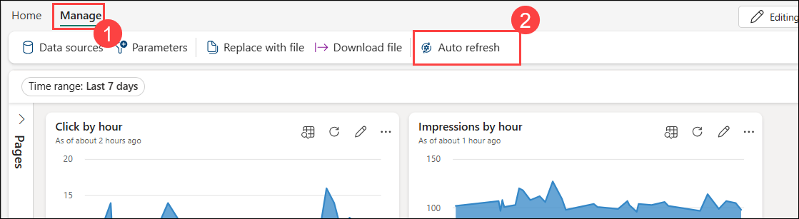

1. In the pane **Auto refresh (1)** set it to **Enabled** and set **Default refresh rate** to **Continous (2)**. Then click on the button **Apply (3)**.

    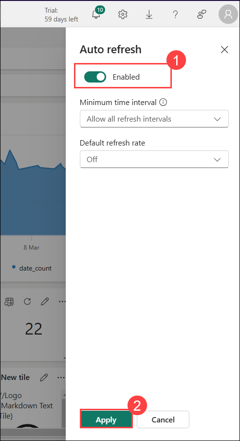

1. Click on the tab **Home** and then click on the button Save.

    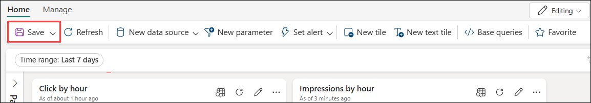

### Task 3: Enable Data Activators

In this task, you will create a Reflex Alert that will send a Teams Message when a value meets a certain threshold.

1. While editing the dashboard, click on the three dots (...) of the tile **Click by hour**. Select **Set alert** from the context menu. This will open the pane **Set alert** at the right side in the browser.

    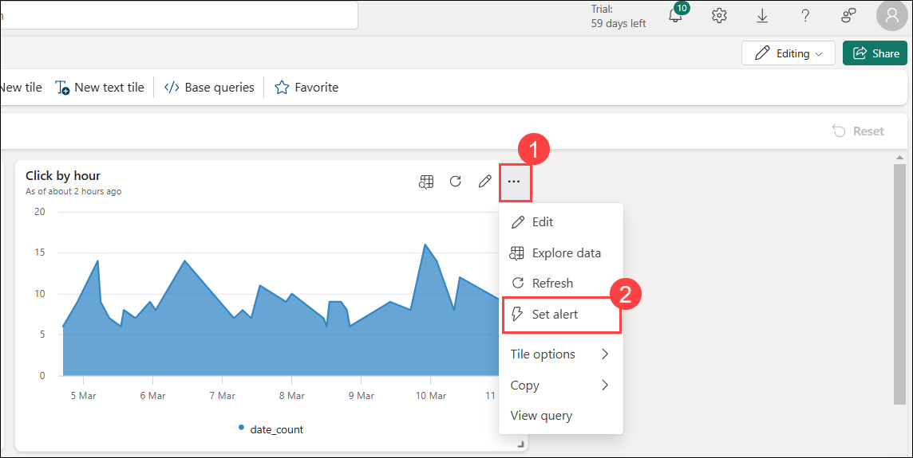

1. In the pane **Set alert** set the values as stated in the following table

    | Field                | Value                      |
    |----------------------|----------------------------|
    | Check                | On each event grouped by (1)  |
    | Grouping field       | eventDate (2)                |
    | When                 | date_count (3)                |
    | Condition            | Becomes greater than (4)      |
    | Value                | 250 (5)                     |
    | Action               | Send me an email (6)           |

1. In the combobox Workspace select the workspace **RTI_<inject key="DeploymentID" enableCopy="false"></inject>**. Ensure that in the combobox Item the value **Create a new item (7)** is selected. Insert **My activator (8)** as value for the field New item name. Then click on the button **Create(9)**.

   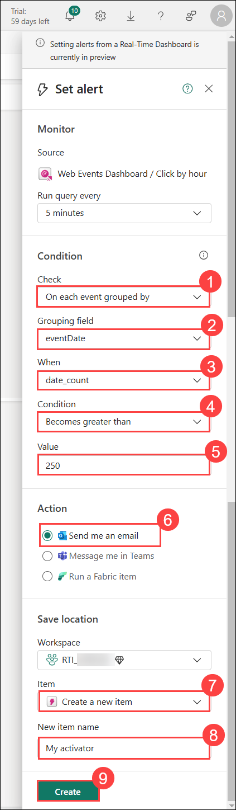

1. You may choose your preferred option in your daily life, but for this lab, we will not be doing it as it is for demonstration purposes.

1. The Reflex item will appear in your workspace and you can edit the Reflex trigger action. The same Reflex item can also trigger multiple actions.

## Review
In this lab you have completed the following:
- Created a Real-Time Dashboard. 
- Enabled Auto-refresh to your dashboard.  
- Enabled Data Activators.

### You have successfully completed the Exercise
