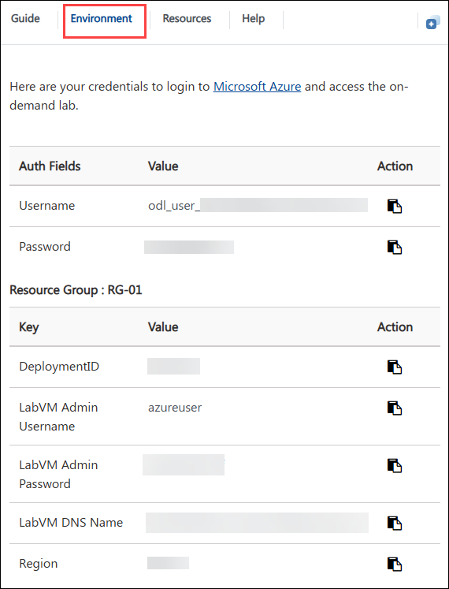
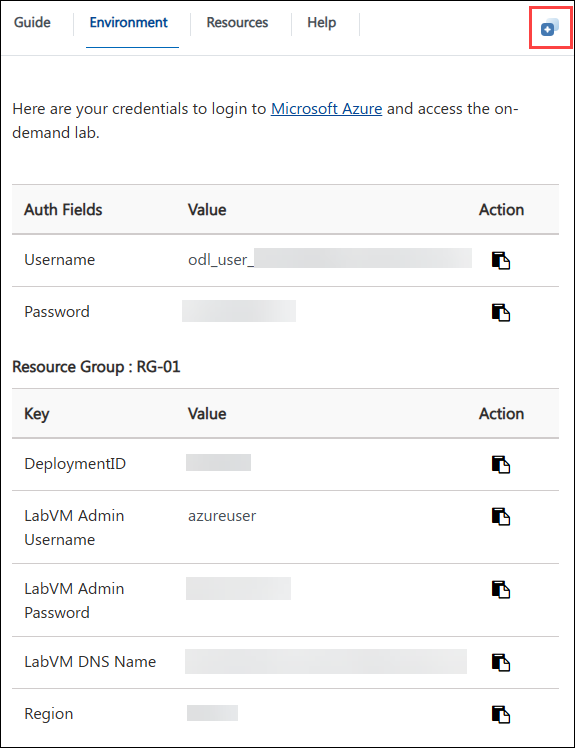
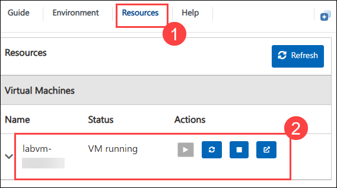

# Getting started with Challenge Environment

### Overall Estimated Duration : 4 Hours

Welcome to Copilot Hackathon, We've prepared a seamless environment for you to explore and learn. Let's begin by making the most of this experience.sharing, collaboration, and online access.
  
### Accessing Your Challenge Environment

Once you're ready to dive in, your virtual machine and Challenge guide will be right at your fingertips within your web browser.

  new.png)

### Exploring Your Challenge Resources

To get a better understanding of your Challenge resources and credentials, navigate to the **Environment** tab.

   

### Utilizing the Split Window Feature

For convenience, you can open the Challenge guide in a separate window by selecting the Split Window button from the Top right corner

   
   
## Managing Your Virtual Machine

On the **Resources (1)** tab, use the **Action buttons (2)** next to your VM. Feel free to **start**, **stop**, or **restart** your Virtual Machine as needed. Your experience is in your hands!

   

## Lab Guide Zoom In/Zoom Out

To adjust the zoom level for the environment page, click the **A↕ : 100%** icon located next to the timer in the lab environment.

   

## Let's Get Started with Power BI Portal
 
1. On the Lab VM, open **Microsoft Edge** from the desktop. In a new tab, navigate to **Microsoft Fabric** by copying and pasting the following URL into the address bar:

   ```
   https://app.powerbi.com/
   ```

2. On the **Enter your email, we'll check if you need to create a new account** tab, you will see the login screen, in that enter the following email/username, and click on **Submit**.
 
   - **Email/Username:** <inject key="AzureAdUserEmail"></inject>
 
     

3. Now enter the following password and click on **Sign in**.
 
   - **Password:** <inject key="AzureAdUserPassword"></inject>
 
     
     
1. If you see the pop-up **Stay Signed in?**, select **No**.

   .png)

1. You should be able to view the Power BI Portal.

1. Once logged in, navigate to **Settings (1)** icon and select **Admin portal (2)** under **Governance and insights** section.

     

1. In the **Tenant settings** (**(1)**), search for **map** **(2)**, then expand the **Map and filled map visuals** **(3)**. If the toggle is not already enabled, switch it to **Enabled** **(4)**, and click **Apply** **(5)** to save the changes.

     

1. Open the **Power BI Desktop** located on the desktop of your lab environment.

     

1. Click on the **Sign-in icon** located in the top-right corner.

     

1. Once the "Enter your email address" dialog appears, copy the **Username** and paste it into the **Email** field of the dialog and select **Continue**.

   * Email/Username: <inject key="AzureAdUserEmail"></inject>

     

1. After clicking Continue, you will be prompted to sign in again. Please use the credentials provided below to log in.

   * Email/Username: <inject key="AzureAdUserEmail"></inject>

     

1. Enter password and **Sign in**

   - **Password:** <inject key="AzureAdUserPassword"></inject>

     

1. For the pop-up **Automatically sign in to all desktop apps and websites on this device?** window, select **No,this app only**

   

1. Keep this browser tab open, you will be using this further.

1. Now, click on the **Next** from lower right corner to move on next page.

## Happy Learning!!
